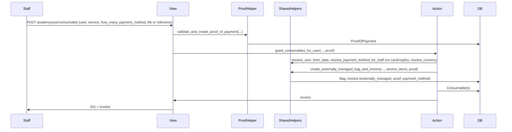

# Academy grant consumables endpoint

## Goal

- Allow academy staff to add consumables to a user (grant mentorship/event access) with a **required** payment method that is **not** credit card or crypto, and **proof of payment** (file or reference), mirroring the existing staff plan-financing flow.
- **Reuse the majority of the code** by extracting a shared "staff + proof + payment method" path so both staff plan and staff consumables use the same helpers; only "what goes in the bag" and "what to deliver" differ.

## Constraints (confirmed)

- **Payment method required**: Staff must send a `payment_method` (PaymentMethod id). For consumables only: must have `is_credit_card=False` and `is_crypto=False`.
- **Proof of payment**: Same as staff plan — staff provides `file` (upload id) and/or `reference` (and optionally `provided_payment_details`). Reuse [validate_and_create_proof_of_payment](breathecode/payments/actions.py).
- **Both flows generate invoices**: User checkout and staff flows both create an Invoice; staff flow uses proof + payment_method (externally_managed).

---

## 0. Consumable.standalone_invoice (trace standalone purchase)

Add an optional FK on Consumable to Invoice so we can know which standalone purchase (or staff grant) created a consumable. The codebase uses Invoice as the canonical payment event. Naming it `standalone_invoice` makes it clear this is for one-off buys/grants, not for consumables from subscription/plan renewal.

### 0.1 Model and migration

- **File**: [breathecode/payments/models.py](breathecode/payments/models.py) — in `class Consumable(AbstractServiceItem)`, add:
  - `standalone_invoice = models.ForeignKey(Invoice, on_delete=models.SET_NULL, null=True, blank=True, default=None, related_name="standalone_consumables", help_text="Invoice that generated this consumable when it was bought or granted standalone (e.g. user consumable checkout or staff grant). Null for consumables created from subscription or plan renewal.")`
- Add a Django migration for the new field (nullable; no backfill required).

### 0.2 Set standalone_invoice at creation sites

Set `consumable.standalone_invoice = invoice` whenever a Consumable is created in a context where the generating Invoice exists (standalone purchase or grant):

| Location                                                                                                               | Change                                                                                                                                                                   |
| ---------------------------------------------------------------------------------------------------------------------- | ------------------------------------------------------------------------------------------------------------------------------------------------------------------------ |
| [breathecode/payments/views.py](breathecode/payments/views.py) — ConsumableCheckoutView (~4426)                        | After `invoice = s.pay(...)`, create Consumable with `standalone_invoice=invoice`.                                                                                       |
| [breathecode/payments/actions.py](breathecode/payments/actions.py) — grant_consumables_for_user (step 7)               | Create Consumable with `standalone_invoice=invoice` (from create_externally_managed_bag_and_invoice).                                                                    |
| [breathecode/payments/tasks.py](breathecode/payments/tasks.py) — build_consumables_from_bag                            | Optional: set `standalone_invoice=bag.invoices.filter(status=FULFILLED).first()` when creating each Consumable if exactly one fulfilled invoice exists; else leave null. |
| [breathecode/payments/tasks.py](breathecode/payments/tasks.py) — renew_consumables                                     | No invoice in context (renewal from scheduler); leave standalone_invoice null.                                                                                           |
| [breathecode/payments/actions.py](breathecode/payments/actions.py) — process_auto_recharge (Consumable.objects.create) | If the auto-recharge flow creates an Invoice for the new consumable, set it when creating the Consumable; otherwise leave null.                                          |

Do not change Consumable creation that is tied to subscription/plan_financing only (those already have subscription/plan_financing FKs).

### 0.3 Tests for Consumable.standalone_invoice

- **Fix affected unit tests**: The new field is optional (`null=True, blank=True`). Existing tests that create Consumable via `database.create(consumable=...)` or `Consumable.objects.create(...)` without `standalone_invoice` should still pass. If any test asserts on the full list of Consumable fields (e.g. expected dict in GET consumable responses), add `"standalone_invoice": consumable.standalone_invoice.id if consumable.standalone_invoice else None` to the expected payload only if the API is updated to expose it in consumable serialization; otherwise no change. Run the payments test suite after adding the field and fix any failures (e.g. serializers or admin that validate/strictly list fields).
- **New tests**: (1) User consumable checkout: after POST consumable/checkout success, assert the created Consumable has `standalone_invoice_id` set to the returned invoice id. (2) Staff grant consumables: after POST academy/user/consumable success, assert the created Consumable has `standalone_invoice_id` set to the returned invoice id. (3) Optional: consumables created by renew_consumables or without an invoice have `standalone_invoice=None`.

---

## 1. Shared staff payment flow (refactor)

Extract helpers in [breathecode/payments/actions.py](breathecode/payments/actions.py) so **validate_and_create_subscriptions** and the new **grant_consumables_for_user** share one path. No duplication of bag/invoice/proof logic.

### 1.1 New helpers in `actions.py`

| Helper                                                                                                                                                                                                                                                | Purpose                                                                                                                                                                                                                                                                                                                                                                                      |
| ----------------------------------------------------------------------------------------------------------------------------------------------------------------------------------------------------------------------------------------------------- | -------------------------------------------------------------------------------------------------------------------------------------------------------------------------------------------------------------------------------------------------------------------------------------------------------------------------------------------------------------------------------------------- |
| **resolve_user_from_data(data, lang)**                                                                                                                                                                                                                | Resolve user by id or email from `data`; raise ValidationException if missing or not found. Same logic as in current validate_and_create_subscriptions.                                                                                                                                                                                                                                      |
| **resolve_payment_method_for_staff(data, academy_id, lang, allow_card_and_crypto=False)**                                                                                                                                                             | Resolve payment_method id from data; must exist and belong to academy (or global). When `allow_card_and_crypto=False`, raise if `payment_method.is_credit_card` or `payment_method.is_crypto` (slug e.g. `payment-method-must-not-be-card-or-crypto`). Plan flow calls with `True`, consumables with `False`.                                                                                |
| **resolve_currency_for_staff_payment(payment_method, academy, lang)**                                                                                                                                                                                 | Return `payment_method.currency or academy.main_currency`; raise if neither.                                                                                                                                                                                                                                                                                                                 |
| **create_externally_managed_bag_and_invoice(user, academy, currency, amount, payment_method, proof_of_payment, lang, bag_type=..., plans=None, service_items=None, how_many_installments=1, chosen_period=None, amount_breakdown=None, **bag_extra)** | Create Bag (user, academy, currency, status=PAID, type=bag_type, optional how_many_installments/chosen_period); attach plans or service_items; create Invoice (amount, paid_at, user, bag, academy, FULFILLED, currency, proof, payment_method, externally_managed=True, optional amount_breakdown via calculate_invoice_breakdown when bag has plans/service_items). Return (bag, invoice). |

### 1.2 Refactor validate_and_create_subscriptions

- Keep proof creation in the view (unchanged): view calls `validate_and_create_proof_of_payment`, then passes proof into the action.
- Inside **validate_and_create_subscriptions**: resolve plan, option, cohort, coupons from data; then use:
  - `user = resolve_user_from_data(data, lang)` (plus plan-specific checks, e.g. no existing valid plan financing).
  - `payment_method = resolve_payment_method_for_staff(data, academy_id, lang, allow_card_and_crypto=True)`.
  - `currency = resolve_currency_for_staff_payment(payment_method, academy, lang)`.
  - `amount = get_discounted_price(option.monthly_price, coupons)`.
  - `bag, invoice = create_externally_managed_bag_and_invoice(..., plans=plans, how_many_installments=..., amount_breakdown=..., chosen_period=...)`.
  - Coupon rewards; then `tasks.build_plan_financing.delay(bag.id, invoice.id, ...)`; return invoice, coupons.

Existing behavior (proof, payment method, bag, invoice, build_plan_financing) stays the same; implementation delegates to the shared helpers.

---

## 2. New capability

- **File**: [breathecode/authenticate/role_definitions.py](breathecode/authenticate/role_definitions.py)
- Add capability `crud_consumable` (e.g. "Create or grant consumables for users; staff-only, requires non-card payment method").
- Add to roles that should grant consumables (e.g. admin, roles with read_consumable/crud_invoice).
- Confirm [create_academy_roles](breathecode/authenticate/management/commands/create_academy_roles.py) syncs the new capability if it reads from role_definitions.

---

## 3. New action: grant_consumables_for_user

- **File**: [breathecode/payments/actions.py](breathecode/payments/actions.py)
- **Proof**: Not created inside this action. View creates it via `validate_and_create_proof_of_payment(request, request.user, academy_id, lang)` (same as [AcademyPlanSubscriptionView](breathecode/payments/views.py)), then passes proof into the action (or action receives request and creates proof internally — prefer same pattern as plan: view creates proof, then calls action with proof).
- **Flow**:
  1. Resolve service, service_item (ServiceItem.get_or_create_for_service), how_many, mentorship_service_set/event_type_set; validate AcademyService and service type (MENTORSHIP_SERVICE_SET or EVENT_TYPE_SET only).
  2. `user = resolve_user_from_data(data, lang)`.
  3. `payment_method = resolve_payment_method_for_staff(data, academy_id, lang, allow_card_and_crypto=False)`.
  4. `currency = resolve_currency_for_staff_payment(payment_method, academy, lang)`.
  5. `amount` = from service pricing (e.g. AcademyService.get_discounted_price) or explicit in data (e.g. 0 or "what user paid"); support optional `amount` in request.
  6. `bag, invoice = create_externally_managed_bag_and_invoice(..., bag_type=CHARGE or STAFF_GRANT, service_items=[service_item], amount=amount)`.
  7. Create **Consumable**(service_item, user, how_many, mentorship_service_set, event_type_set, **standalone_invoice=invoice**).
  8. Return invoice (and optionally consumable summary).

Validation: payment_method required and not card/crypto; user, service, how_many required; mentorship_service_set/event_type_set when required by service type; AcademyService must exist for academy/service/sets.

---

## 4. New view and URL

- **File**: [breathecode/payments/views.py](breathecode/payments/views.py)
- **AcademyGrantConsumableView**: POST only, `@capable_of("crud_consumable")`.
  - Create proof: `proof = actions.validate_and_create_proof_of_payment(request, request.user, academy_id, lang)` (same as staff plan). On failure of the action, delete proof and re-raise.
  - Request body: `user`, `service`, `how_many`, `payment_method`, optional `mentorship_service_set` / `event_type_set`, optional `amount` (for invoice when user already paid).
  - Call `grant_consumables_for_user` (or equivalent) with proof and request data; return 201 with serialized invoice (and optional consumable info).
- **File**: [breathecode/payments/urls/v1.py](breathecode/payments/urls/v1.py)
  - e.g. `path("academy/user/consumable", AcademyGrantConsumableView.as_view(), name="academy_user_consumable")`, placed so it does not conflict with `academy/service/consumable` (GET).

---

## 5. Validation summary

- **payment_method**: Required; exists; for this academy or global. Consumables: must have `is_credit_card=False` and `is_crypto=False`.
- **user**: Required; exists (id or email).
- **service**: Required; exists; type MENTORSHIP_SERVICE_SET or EVENT_TYPE_SET only.
- **how_many**: Required; integer > 0.
- **Proof**: Same as staff plan — at least one of `file` or `reference` in request (handled by validate_and_create_proof_of_payment).
- **mentorship_service_set / event_type_set**: Required when service type requires it (mirror ConsumableCheckoutView).
- **AcademyService**: Must exist for (academy, service) and sets when applicable.

---

## 6. Flow diagram

---

## 7. Testing

- **Consumable.standalone_invoice (see section 0.3)**: Fix any unit test that breaks after adding the optional `standalone_invoice` field (e.g. strict field lists, serializers). Add tests that assert `consumable.standalone_invoice_id` is set after user consumable checkout and after staff grant consumables; optionally assert `standalone_invoice=None` for consumables from renew_consumables.
- **Shared helpers**: Unit tests for resolve_user_from_data, resolve_payment_method_for_staff (with/without allow_card_and_crypto), resolve_currency, create_externally_managed_bag_and_invoice (with plans and with service_items).
- **validate_and_create_subscriptions**: Regression tests ensuring behavior unchanged after refactor (same invoice/bag/plan financing outcome).
- **Grant consumables**: Success with valid user, service (mentorship or event), how_many, payment_method (non-card, non-crypto), proof (file or reference); assert Bag, Invoice (externally_managed, payment_method, proof), Consumable created (and consumable.standalone_invoice_id set). Reject when payment_method is card or crypto; reject when payment_method/user/service invalid or missing; reject when proof missing.

**Test files likely touched**: Tests that create or serialize Consumable (e.g. [tests/urls/tests_me_service_consumable.py](breathecode/payments/tests/urls/tests_me_service_consumable.py), [tests/urls/tests_academy_service_consumable.py](breathecode/payments/tests/urls/tests_academy_service_consumable.py), [tests/urls/tests_consumable_checkout.py](breathecode/payments/tests/urls/tests_consumable_checkout.py), [tests/tasks/tests_process_auto_recharge.py](breathecode/payments/tests/tasks/tests_process_auto_recharge.py), [tests/receivers/tests_handle_seat_invite_accepted.py](breathecode/payments/tests/receivers/tests_handle_seat_invite_accepted.py), [tests/receivers/tests_grant_service_permissions_receiver.py](breathecode/payments/tests/receivers/tests_grant_service_permissions_receiver.py)). Fix only if a test fails after adding the field or after setting standalone_invoice at creation sites; add new tests for standalone_invoice linkage where appropriate.

---

## 8. Documentation

- Document new endpoint: POST body (user, service, how_many, payment_method, proof via file/reference, optional amount), 201 response, and that only non-card, non-crypto payment methods are allowed.
- Optionally document that the flow reuses the same proof and externally-managed invoice pattern as staff-assigned plan financing.

---

## Files to add or modify

| File                                                                                                                                         | Change                                                                                                                                                                                                                                          |
| -------------------------------------------------------------------------------------------------------------------------------------------- | ----------------------------------------------------------------------------------------------------------------------------------------------------------------------------------------------------------------------------------------------- |
| [breathecode/payments/models.py](breathecode/payments/models.py)                                                                             | Add Consumable.standalone_invoice (optional FK to Invoice, with help text).                                                                                                                                                                     |
| breathecode/payments/migrations/                                                                                                             | New migration for Consumable.standalone_invoice.                                                                                                                                                                                                |
| [breathecode/payments/views.py](breathecode/payments/views.py)                                                                               | ConsumableCheckoutView: set consumable.standalone_invoice after s.pay(); add AcademyGrantConsumableView (POST, proof then grant_consumables_for_user).                                                                                          |
| [breathecode/payments/actions.py](breathecode/payments/actions.py)                                                                           | Extract shared helpers; refactor validate_and_create_subscriptions; add grant_consumables_for_user (set consumable.standalone_invoice); optionally set standalone_invoice in process_auto_recharge/build_consumables_from_bag where applicable. |
| [breathecode/payments/tasks.py](breathecode/payments/tasks.py)                                                                               | Optionally set consumable.standalone_invoice in build_consumables_from_bag when one fulfilled invoice exists.                                                                                                                                   |
| [breathecode/authenticate/role_definitions.py](breathecode/authenticate/role_definitions.py)                                                 | Add capability crud_consumable; add to relevant roles.                                                                                                                                                                                          |
| [breathecode/authenticate/management/commands/create_academy_roles.py](breathecode/authenticate/management/commands/create_academy_roles.py) | Ensure new capability synced if needed.                                                                                                                                                                                                         |
| [breathecode/payments/urls/v1.py](breathecode/payments/urls/v1.py)                                                                           | Register academy/user/consumable (or equivalent).                                                                                                                                                                                               |
| breathecode/payments/tests/                                                                                                                  | Fix tests affected by Consumable.standalone_invoice; add tests for standalone_invoice linkage (checkout, staff grant); tests for shared helpers, refactored plan flow, grant consumables.                                                       |
| Docs / OpenAPI                                                                                                                               | Document endpoint and payment method restriction.                                                                                                                                                                                               |

---

## Out of scope

- Allowing credit card or crypto on the consumables grant endpoint.
- SEAT service type (subscription seat flow remains separate).
- Changing user consumable checkout or academy GET consumable behavior.

