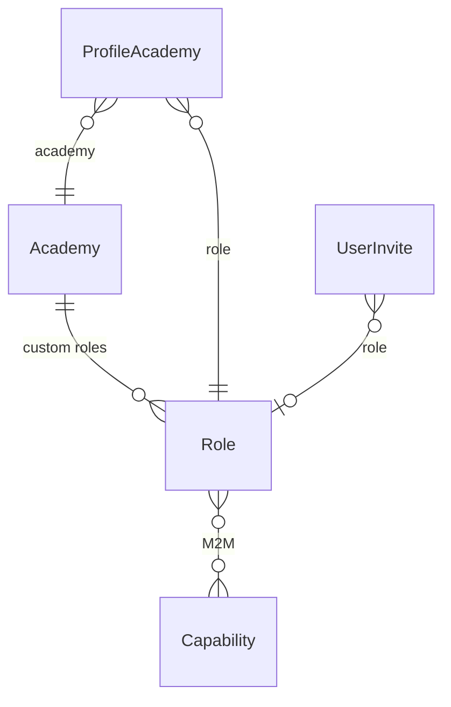

# Academy-managed roles (single Role + academy FK)

## Design decisions (from discussion)

- **Single Role model**: No AcademyRole. Add optional `academy` FK to [Role](breathecode/authenticate/models.py). `academy_id is null` = native (platform-managed); `academy_id` set = custom (academy-managed).
- **Slug stays PK**: No migration of [ProfileAcademy](breathecode/authenticate/models.py).role_id or [UserInvite](breathecode/authenticate/models.py).role_id. Slug remains globally unique.
- **Uniqueness via academy id suffix**: When an academy creates a custom role with base slug `"content_editor"`, store `slug = f"{base_slug}_{academy_id}"` (e.g. `content_editor_1`, `content_editor_2`). No hash; we reuse academy id so we know how to strip for display.
- **display_slug property**: On the Role model, add a calculated property `display_slug` that returns the slug with the academy id suffix stripped for UI friendliness. Serializers and APIs use `role.display_slug` when exposing the human-readable slug; keep `slug` for canonical identity and API calls.

## Role model: display_slug property

Add to Role in [authenticate/models.py](breathecode/authenticate/models.py):

```python
@property
def display_slug(self):
    """Slug without academy id suffix, for UI display. Native roles return slug as-is."""
    if self.academy_id is not None and self.slug.endswith(f"_{self.academy_id}"):
        return self.slug.removesuffix(f"_{self.academy_id}")
    return self.slug
```

Serializers expose `display_slug` (and keep `slug`) so the frontend can show the friendly slug without duplicating strip logic.

## Data model



- **Role**: Add `academy = models.ForeignKey(Academy, null=True, blank=True, on_delete=models.CASCADE)`. Keep `slug` (PK), `name`, `capabilities` (M2M). Add `display_slug` property (above). Native roles: `academy_id is null`. Custom: `academy_id` set, `slug = "{base}_{academy_id}"`.
- **ProfileAcademy / UserInvite**: No schema change. Still single `role` FK to Role.
- **create_academy_roles**: Only create/update roles where `academy_id is null`. Do not touch academy-owned roles.

## Slug and display rules

- **Native roles**: Slug unchanged (e.g. `staff`, `teacher`). No suffix; `display_slug` equals `slug`.
- **Custom role creation**: Academy sends `name` and base slug (e.g. `content_editor`). Backend sets `slug = f"{base_slug}_{academy.id}"`, validates base_slug format, and checks that `slug` does not already exist (PK).
- **Display**: Use `role.display_slug` in serializers and UI; use `role.slug` when referencing the role by canonical slug (e.g. in URLs or subsequent API calls).

## Assignment and listing rules

- **Assign role to member/invite**: Accept role by slug (or id). Only allow if `role.academy_id is null` (native) or `role.academy_id == request academy_id`. Reject with clear error otherwise.
- **List roles for an academy**: `Role.objects.filter(Q(academy__isnull=True) | Q(academy_id=academy_id))`. Optionally order by native first, then custom. Expose `display_slug` and a `native: bool` (true when `academy_id is null`) so UI can show read-only vs editable.

## API

- **List capabilities**: `GET /academy/<academy_id>/capability` — return all [Capability](breathecode/authenticate/models.py) slugs (and description) for building role form. Permission: e.g. new `manage_academy_roles` or existing like `crud_member`.
- **List roles for academy**: `GET /academy/<academy_id>/role` — native + that academy's custom roles. Each item: slug, display_slug, name, capabilities, native (read-only). Permission: same as above or read-only capability.
- **Get one role**: `GET /academy/<academy_id>/role/<slug>` — slug is the stored slug (with suffix for custom). Return 404 if slug not in allowed set (native or this academy's custom).
- **Create custom role**: `POST /academy/<academy_id>/role` — body: name, slug (base, e.g. `content_editor`), capabilities (list of slugs). Set `academy_id`, `slug = f"{slug}_{academy_id}"`, name, capabilities. Validate base slug not empty and not conflicting with existing PK. Permission: `manage_academy_roles`.
- **Update custom role**: `PUT /academy/<academy_id>/role/<slug>` — only if role.academy_id == academy_id. Allow updating name and capabilities; do not allow changing slug (it encodes academy id). Permission: `manage_academy_roles`.
- **Delete custom role**: `DELETE /academy/<academy_id>/role/<slug>` — only if role.academy_id == academy_id. Forbid if any ProfileAcademy or UserInvite uses this role; return error with message. Permission: `manage_academy_roles`.

## Capability and permission

- Add capability `manage_academy_roles` in [role_definitions.py](breathecode/authenticate/role_definitions.py) and assign **only** to: **admin** (system admin) and **country_manager** (academy admin). No other roles get this capability.
- [capable_of](breathecode/utils/decorators/capable_of.py): No change. ProfileAcademy still has single role FK; role.capabilities work for both native and custom roles.
- [AcademyCapabilitiesView](breathecode/authenticate/views.py): No change (still collects role.capabilities).

## Member and invite flows

- **MemberView** ([views.py](breathecode/authenticate/views.py)): When resolving `role` from request (slug or id), after fetching Role check: `role.academy_id is None or role.academy_id == academy_id`. If not, return 400 (role not available for this academy). No change to serializer payload; still pass role pk (slug) to serializer.
- **Invite creation**: Same rule when setting UserInvite.role: only allow native or this academy's custom role.
- **Invite acceptance** ([actions.py](breathecode/authenticate/actions.py)): No change; ProfileAcademy.role already set from invite.role.
- **Serializers**: Where role is serialized (e.g. [RoleSmallSerializer](breathecode/authenticate/serializers.py), ProfileAcademy serializers), expose `display_slug` from `role.display_slug` for UI; keep returning full `slug` for API consistency.

## Validation

- **Reserved base slugs**: Optionally reject base slugs that match native role slugs (from get_extended_roles()) so academies cannot create e.g. "staff_1". Recommended to avoid confusion.
- **Delete custom role**: Before delete, check `ProfileAcademy.objects.filter(role=role).exists()` and `UserInvite.objects.filter(role=role).exists()`; if any, return 400 with message that role is in use.

## Migration

- One migration: add `academy` FK to Role (null=True, blank=True). Backfill: existing roles already have no academy (leave null). No changes to ProfileAcademy or UserInvite.

## Key files

| Area | File(s) | Change |
|------|--------|--------|
| Model | [authenticate/models.py](breathecode/authenticate/models.py) | Role: add academy FK (nullable); add display_slug property. |
| Role definitions | [authenticate/role_definitions.py](breathecode/authenticate/role_definitions.py) | Add capability manage_academy_roles; assign only to admin and country_manager. |
| create_academy_roles | [authenticate/management/commands/create_academy_roles.py](breathecode/authenticate/management/commands/create_academy_roles.py) | Filter to roles where academy_id is null (create/update only native). |
| Member/invite views | [authenticate/views.py](breathecode/authenticate/views.py) | When resolving role for assignment, enforce role.academy_id in (None, academy_id). |
| Serializers | [authenticate/serializers.py](breathecode/authenticate/serializers.py) | Role serializers: expose display_slug (from role.display_slug). |
| New API | New views + [authenticate/urls/v1.py](breathecode/authenticate/urls/v1.py) | GET/POST/PUT/DELETE academy role; GET academy capabilities. |

## Testing

- Native roles: academy_id null; create_academy_roles only touches them; list for academy includes them with native=true; display_slug equals slug.
- Custom role: create with base slug; stored slug has academy id; display_slug strips suffix; update/delete only by owning academy.
- Assignment: allow native or same-academy custom role; reject other academy's custom role.
- Delete: forbid when role is used by any ProfileAcademy or UserInvite.
