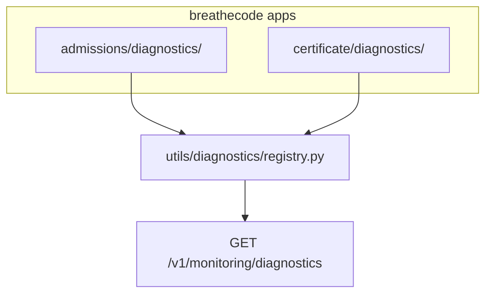

# Django diagnostics layer + monitoring catalog

## Goals

- **Per-app convention**: Any `breathecode.<app>` may ship a **`diagnostics/`** package containing reusable diagnostic builders (errors, misconfigurations, blocking rules).
- **Discoverability for AI agents**: Each diagnostic module exposes **explicit machine-readable metadata** (name + description at minimum) so agents and humans know scope without reading implementation.
- **Cross-app standard**: Same patterns whether the diagnostic lives in admissions, certificate, payments, etc.
- **Operations**: Keep **management commands** as thin wrappers calling the same functions as HTTP (no duplicated logic).
- **Monitoring API**: **`GET` endpoint under the monitoring app** that returns **all registered diagnostics**, with **`app_label` filter** (e.g. `?app_label=admissions`).

## Non-goals (initial slice)

- Full execution API for every diagnostic in monitoring (optional later; graduation/certificate “run” can remain academy-scoped under certificate/admissions per prior discussion).

## Standard layout

```
breathecode/<app_label>/
  diagnostics/
    __init__.py          # REGISTERED_DIAGNOSTICS = [...] aggregating this app’s specs
    graduation.py        # Example: constants + build_* functions
    certificate.py       # ...
```

**Module header contract** (required for agent-friendly parsing):

- **`DIAGNOSTIC_SLUG`** — unique string, convention `{app_label}.{short_name}` e.g. `admissions.graduation`.
- **`DIAGNOSTIC_NAME`** — human-readable title.
- **`DIAGNOSTIC_DESCRIPTION`** — multi-line string describing what it checks and when to use it.

Alternatively (if you prefer a single block): one module docstring with structured lines — but **constants are easier for registry code** and for serializers.

**Builders**: Pure functions returning **JSON-serializable dicts** (checks, issues, warnings, summary). No `print()` inside builders.

## Shared types / registry

Add something like **`breathecode/utils/diagnostics/spec.py`** (or `types.py`):

- **`DiagnosticSpec`** — `slug`, `app_label`, `name`, `description`, optional `tags` (`["certificate","cohort"]`), optional `parameters` schema placeholder for future run APIs.

**Discovery** — **`breathecode/utils/diagnostics/registry.py`**:

- Loop `django.apps.apps.get_app_configs()` (or filter `name.startswith("breathecode.")`).
- `importlib.import_module(f"{app}.diagnostics")` when present.
- Read **`REGISTERED_DIAGNOSTICS`** (list of `DiagnosticSpec`) from each package `__init__.py`.
- Expose **`list_diagnostics(app_label: str | None = None) -> list[DiagnosticSpec]`** for the monitoring view and tests.

Avoid import-time side effects (heavy DB) inside `diagnostics/__init__.py`; only register metadata and lazy-import builders if needed.

## Refactor existing commands

- **[`diagnose_graduation`](breathecode/admissions/management/commands/diagnose_graduation.py)** → logic in **`breathecode/admissions/diagnostics/graduation.py`**; command calls builder + stdout formatting; `--force-graduate` stays CLI-only.
- **[`diagnose_certificate`](breathecode/certificate/management/commands/diagnose_certificate.py)** → **`breathecode/certificate/diagnostics/certificate.py`** same pattern.

Each module registers one **`DiagnosticSpec`** pointing at the slug/name/description.

## Monitoring endpoint

- **Path**: e.g. **`GET /v1/monitoring/diagnostics`** (add to [`breathecode/monitoring/urls.py`](breathecode/monitoring/urls.py)).
- **Query**: `app_label` optional — filter registry results (`admissions`, `certificate`, …).
- **Response**: JSON list of objects mirroring `DiagnosticSpec` (slug, app_label, name, description, tags, …).
- **Authorization — capabilities (required)**:
  - Use **`@capable_of("<slug>")`** on the view `get` method, same pattern as other monitoring views (e.g. reports use `read_monitoring_report` in [`breathecode/monitoring/views.py`](breathecode/monitoring/views.py)).
  - **Academy resolution** comes from the request (header / context) as with all `capable_of` views; the handler receives `academy_id` in kwargs per [`views.mdc`](.cursor/rules/views.mdc).
  - **Capability slug** (choose at implementation time):
    - **Option A — reuse** `read_monitoring_report` for the diagnostics catalog only, so anyone who can read monitoring reports can list diagnostic metadata.
    - **Option B — new capability** e.g. `read_diagnostics` in [`breathecode/authenticate/role_definitions.py`](breathecode/authenticate/role_definitions.py) and wire it to the appropriate academy roles (mirroring how `read_monitoring_report` is assigned) for tighter ACL.
  - **Future “run” diagnostic HTTP APIs** (if added) should also use **`@capable_of`**, with slugs appropriate to the domain (e.g. `read_certificate` + cohort/student scoping for certificate runs, or a dedicated capability if you want run separate from read).

## Tests

- **Registry**: unit test that discovery returns at least the two refactored diagnostics.
- **Monitoring URL**: GET with/without `app_label`; **401/403** when unauthenticated or missing capability for the academy; success when `ProfileAcademy` has the required capability.

## Diagram



## Relation to prior “student diagnostic API” plan

- **Catalog** (this plan) is the **index** agents call first.
- **Run** endpoints for academy-scoped graduation/certificate checks remain a **separate follow-up** (certificate app or monitoring `run` sub-resource) so this layer stays metadata-first and safe.

## Cursor rule (deliverable)

Add a workspace rule file, e.g. **[`.cursor/rules/diagnostics.mdc`](.cursor/rules/diagnostics.mdc)** (or `diagnostics-authoring.mdc`), with `globs` targeting `breathecode/*/diagnostics/**/*.py`, `breathecode/utils/diagnostics/**/*.py`, and management commands named `diagnose_*`.

**Rule should tell agents and humans to:**

- Prefer adding **reusable diagnostic builders** under **`breathecode/<app>/diagnostics/`** instead of embedding one-off troubleshooting logic only inside views, serializers, or long management commands.
- Every new diagnostic module must define **`DIAGNOSTIC_SLUG`**, **`DIAGNOSTIC_NAME`**, **`DIAGNOSTIC_DESCRIPTION`** at the top and register via **`REGISTERED_DIAGNOSTICS`** in that app’s **`diagnostics/__init__.py`**.
- Builders return **structured JSON-serializable dicts**; **no `print()`** in builders (CLI/API format output at the edge).
- **`manage.py diagnose_*`** commands stay **thin**: parse args → call builder → format stdout.
- New **HTTP** surfaces for diagnostics use **`@capable_of`** and academy scope per **[`views.mdc`](.cursor/rules/views.mdc)**.
- Point to the **registry** (`breathecode.utils.diagnostics`) and **catalog endpoint** (`GET /v1/monitoring/diagnostics`) once implemented.

Reference **[`.cursor/rules/skill-authoring.mdc`](.cursor/rules/skill-authoring.mdc)** only where the rule mentions documenting workflows for skills (avoid duplicating full skill structure inside the rule).

## Agent skill (deliverable)

Add **[`docs/llm-docs/skills/bc-diagnostics-author-and-registry/SKILL.md`](docs/llm-docs/skills/bc-diagnostics-author-and-registry/SKILL.md)** following **[`skill-authoring.mdc`](.cursor/rules/skill-authoring.mdc)**:

- **Frontmatter**: `name`, `description` (include when **not** to use — e.g. do not use for one-off DB fixes or unrelated debugging).
- **When to use**: Adding a new diagnostic, registering it, or using the monitoring catalog / future run APIs for support and configuration troubleshooting.
- **Workflow**: Numbered steps — discover existing diagnostics via catalog API; add module under correct app; register; wire CLI; optional HTTP and capabilities.
- **Endpoints**: Document **`GET /v1/monitoring/diagnostics`** (Academy header, capability), query `app_label`, example JSON response listing `DiagnosticSpec` fields; note pagination if applicable.
- **Edge cases**: Missing app `diagnostics` package; duplicate slug; heavy imports in `__init__.py`.
- **Checklist**: Slug uniqueness, registration, tests, capability assignment.

Cross-link from **[`docs/LLM-DOCS/skills/breathecode-staff-api-index/SKILL.md`](docs/LLM-DOCS/skills/breathecode-staff-api-index/SKILL.md)** only if that index already lists related monitoring skills (optional small “See also” — do not bloat the index).

## Optional follow-ups

- OpenAPI / static JSON export for agents.
