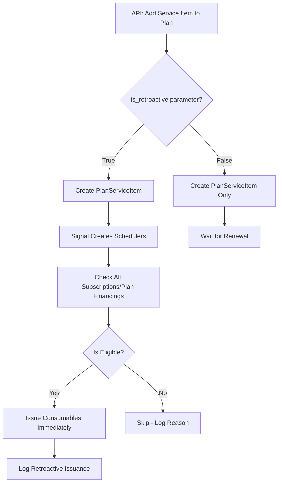

# Retroactive Consumable Stock Implementation Plan

## Overview

When a service item is added to a plan via the API, an optional `is_retroactive` parameter can be provided. If `true`, the system will immediately issue consumables to all eligible existing subscribers/plan financings after creating the `PlanServiceItem` relationship. This provides better customer experience while maintaining control over when retroactive issuance occurs.

## Architecture

The retroactive decision is made at API call time via a request parameter. No database field is needed - the decision is immediate and action-based.

## Implementation Steps

### 1. Create Helper Function for Eligibility Checks

**File:** `breathecode/payments/actions.py` (or `breathecode/payments/tasks.py`)

Create helper function `should_issue_retroactive_consumables()` that checks:

- Subscription/PlanFinancing status is ACTIVE
- Resource is paid (using `is_subscription_paid()` or `is_plan_financing_paid()`)
- `next_payment_at > now` (not past due)
- `valid_until > now` (if set, not expired)
- Plans are not DISCONTINUED or DELETED

Returns tuple: `(is_eligible: bool, reason: str)` for logging purposes.

### 2. Update API Endpoint to Accept Parameter and Trigger Issuance

**File:** `breathecode/payments/views.py`

Modify `AcademyPlanServiceItemView.post()` method:

- Accept optional `is_retroactive` parameter in request body (default: `False` for safety)
- After creating `PlanServiceItem` records (which triggers the signal to create schedulers)
- If `is_retroactive == True`:

  1. Wait briefly for schedulers to be created (or query for them)
  2. Find all subscriptions with this plan that are eligible
  3. Find all plan financings with this plan that are eligible
  4. For each eligible subscription: call `renew_subscription_consumables.delay(subscription_id)`
  5. For each eligible plan financing: call `renew_plan_financing_consumables.delay(plan_financing_id)`
  6. Log all attempts and results

**Note:** The signal receiver (`plan_m2m_changed`) will still create schedulers automatically. We trigger consumable issuance immediately after if retroactive is requested.

### 3. Handle Team/Seat Scenarios

Ensure retroactive issuance works correctly for:

- PER_TEAM consumption strategy
- PER_SEAT consumption strategy
- Team-owned consumables
- Seat-specific consumables

The existing `renew_subscription_consumables` and `renew_plan_financing_consumables` tasks already handle these scenarios, so they should work automatically.

### 4. Add Logging and Audit Trail

**Files:** `breathecode/payments/tasks.py`

Add comprehensive logging:

- When retroactive issuance is attempted
- When eligibility checks fail (and why)
- When consumables are successfully issued retroactively
- Include subscription/plan_financing ID, plan ID, service item ID, and reason

### 5. Update Documentation

**File:** `docs/LLM-DOCS/ACADEMY_PLANS.md`

Update the "Add Service Items to Plan" section to document:

- New `is_retroactive` parameter (optional, defaults to `false`)
- When retroactive issuance occurs (immediately after linking if `true`)
- Eligibility requirements for retroactive issuance
- Example API usage with retroactive flag

### 6. Add Tests

**File:** `breathecode/payments/tests/tasks/tests_update_service_stock_schedulers.py` (new file or existing)

Test cases:

- Retroactive issuance when flag is True and subscription is eligible
- No issuance when flag is False
- No issuance when subscription is not eligible (various reasons)
- No issuance when subscription status is not ACTIVE
- No issuance when subscription is not paid
- No issuance when subscription is expired
- Works for both subscriptions and plan financings
- Works for team and seat scenarios
- Logging verification

## Key Files to Modify

1. `breathecode/payments/views.py` - Update API endpoint to accept parameter and trigger issuance
2. `breathecode/payments/actions.py` or `breathecode/payments/tasks.py` - Add eligibility helper function
3. `breathecode/payments/tests/urls/tests_plan_service_item.py` or new test file - Tests
4. `docs/LLM-DOCS/ACADEMY_PLANS.md` - Documentation

## Safeguards Summary

1. **Eligibility Checks**: Only active, paid subscriptions/plan financings
2. **Status Validation**: Exclude DEPRECATED, EXPIRED, PAYMENT_ISSUE, CANCELLED
3. **Payment Validation**: Must have valid invoices and not be past due
4. **Plan Validation**: Plans must not be DISCONTINUED or DELETED
5. **Opt-in**: Must explicitly set `is_retroactive=true` in API call (defaults to `false` for safety)
6. **Logging**: Full audit trail of all retroactive issuance attempts

## Edge Cases Handled

- Expired subscriptions (valid_until < now)
- Past due subscriptions (next_payment_at < now)
- Unpaid subscriptions (no valid invoices)
- Cancelled/deprecated subscriptions
- Discontinued/deleted plans
- Team vs seat consumption strategies
- Existing schedulers (won't duplicate issuance)