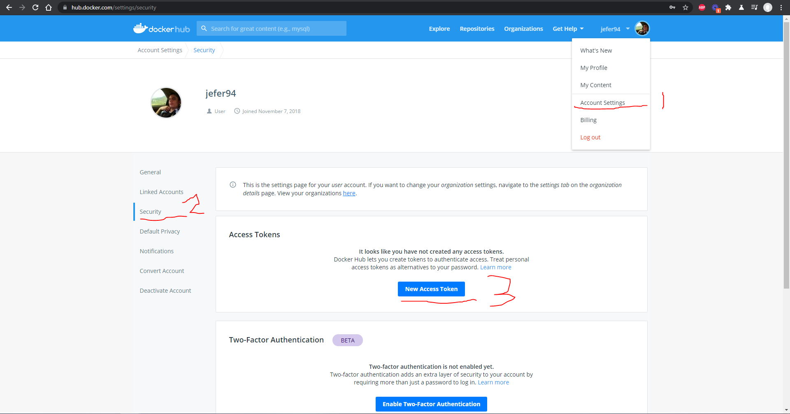
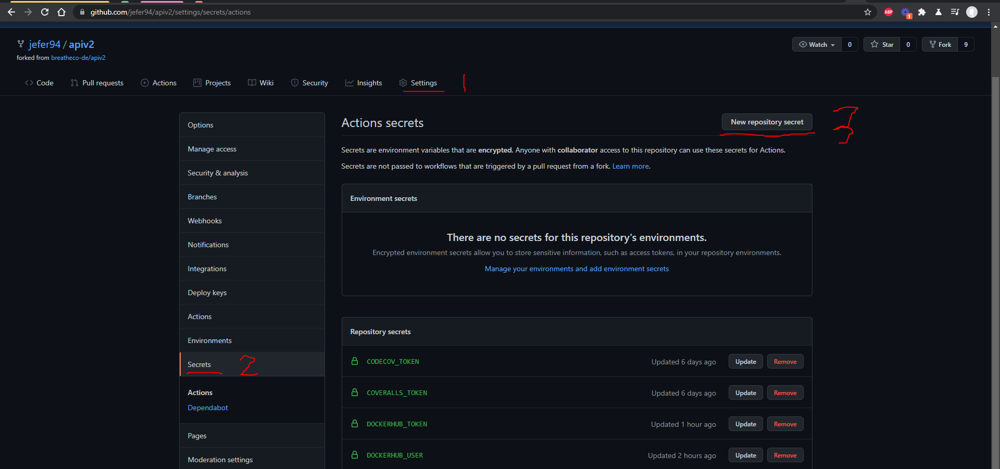

# BreatheCode API

## Setup & Installation with Docker (recomended)

1. Check which dependencies you need install in you operating system `pipenv run doctor`.
2. Instal [docker desktop](https://www.docker.com/products/docker-desktop) in your computer.
3. Install packages and configure your development environment `python -m scripts.install` (this script replace your `.env`).
4. Run containers with `docker-compose up -d`
5. Congratulations!! You API must be running, with the migrations applied and everything.
6. If you need to run any specific command always prepend `docker-compose exec breathecode` to it, followed by your command, for example:
   6.You can create a login user with `docker-compose exec breathecode python manage.py createsuperuser`

### ⚠️ Important!

If you are planning to update the python code, please make sure the docker container python files are 
pointing to your python project, open the docker-compose.json file and add the `bc-shell.volumes` property
with the path to your apiv2 project inside your computer, for example if your python projecy is located
at "./:/home/shell/apiv2" your docker-compose.json should be updated like this:

```yml
bc-shell:
  image: geeksacademy/breathecode:shell
  ports:
    - "8000:8000"
  volumes:
    - ./:/home/shell/apiv2
  ...
```

# Enable formatter in Visual Studio Code

```json
  ...
  "editor.formatOnSave": true,
  "python.formatting.provider": "yapf"
```

# Setup & Installation (without Docker)

1. Check which dependencies you need install in you operating system `pipenv run doctor`.
2. Manually install redis, postgress, python 3.8+ and node 14+.
3. Install packages and configure your development environment `python -m scripts.install` (this script replace your `.env`).
4. Run the migrations into your database `pipenv run migrate`
5. Run the fixtures to add sample data: `pipenv run python manage.py loaddata breathecode/*/fixtures/dev_*.json`
6. Make sure you can login into the django admin, you can create a login user with `python manage.py createsuperuser`
7. Enable pre-commit library: `pipenv run pre-commit install` (this library helps prevent longer error wait times and get instant feedbackpipe)

# Documentation for BreatheCode API Endpoints

[Read the docs](https://documenter.getpostman.com/view/2432393/T1LPC6ef)

# Signals

[More about signals](./docs/references/SIGNALS.md)

# Additional Resources

[Open this project on Gitpod](https://gitpod.io/#https://github.com/breatheco-de/apiv2) for a on-click installation.

### Enable formatter in Visual Studio Code

- Open `.vscode\settings.json`
- Add the following inside the file:

```json
  ...
  "editor.formatOnSave": true,
  "python.formatting.provider": "yapf"
```

### Run the tests

```bash
pipenv run test ./breathecode/
```

### Run coverage

Report with HTML

```bash
pipenv run coverage breathecode
```

### Fixtures

Fixtures are fake data ideal for development.

Saving new fixtures

```bash
python manage.py dumpdata auth > ./breathecode/authenticate/fixtures/users.json
```

Loading all fixtures

```bash
pipenv run python manage.py loaddata breathecode/*/fixtures/dev_*.json
```

### Icons

The following icons are being used for the slack integrations: <https://www.pngrepo.com/collection/soft-colored-ui-icons/1>

# troubleshooting

- `` Executable `yapf\` not found ``: this appear because the pre-commit use the python that found in the $PATH, this project has `yapf` installed in a virtual environment

```bash
# You should run the commands in the virtual environment
pipenv shell
git add .
git commit -m "message"

# You should install globally yapf if you want to commit using vscode
pip install yapf
```

## Configuring the required tokens

1. Get Dockerhub token
   
2. Add the repo to Coveralls https://coveralls.io/repos/new
3. Add the repo to Codecov https://app.codecov.io/gh/+
4. Set up the secrets
   
