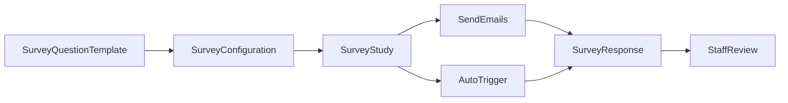

# Skill: Create and Manage NPS Survey (Study Flow)

## When to Use

Use this skill for the modern feedback workflow based on `SurveyQuestionTemplate`, `SurveyConfiguration`, `SurveyStudy`, and `SurveyResponse`. It covers setup, distribution (`send_emails` and trigger-based), and result review.

Do NOT use this skill for legacy cohort surveys built on `Survey`/`Answer`/`SurveyTemplate`/`AcademyFeedbackSettings`, or for tasks that only send notifications without creating survey responses.

## Concepts

- `SurveyQuestionTemplate`: reusable questions JSON.
- `SurveyConfiguration`: trigger and scope definition (`trigger_type`, `cohorts`, `asset_slugs`, `syllabus`).
- `SurveyStudy`: campaign wrapper with status, time window, limits, and aggregate `stats`.
- `SurveyResponse`: one response per user per study (for `send_emails`), with status and answers.
- `send_emails` distribution:
  - Creates responses only if missing for that `(study, user)`.
  - Assigns users round-robin across active configurations in the study.
  - Supports `dry_run`.



## Workflow

1. Set request context for staff endpoints.
   - `Authorization: Token <staff_token>`
   - `Academy: <academy_id>`
   - `Content-Type: application/json`
   - Optional `Accept-Language: en|es` for translated errors.

2. Create or reuse a question template.
   - `POST /v1/feedback/academy/survey/question_template`
   - Save returned `template_id`.

3. Create survey configuration(s).
   - `POST /v1/feedback/academy/survey/configuration`
   - Use either `template` or inline `questions`.
   - Set `trigger_type` and optional filters (`cohorts`, `syllabus`, `asset_slugs`).
   - Save `configuration_id` values.

4. Create study and attach configurations.
   - `POST /v1/feedback/academy/survey/study`
   - Set `starts_at`, `ends_at`, `max_responses` as needed.
   - Save `study_id`.

5. Activate study when ready.
   - `PUT /v1/feedback/academy/survey/study/{study_id}` with `"status": "ACTIVE"`.
   - Ensure linked configurations contain valid questions and share one `trigger_type`.

6. Distribute surveys.
   - Manual campaign:
     - `POST /v1/feedback/academy/survey/study/{study_id}/send_emails`
     - Provide `user_ids`, `cohort_id`, or `cohort_ids`.
     - Optionally set `callback` and `dry_run`.
   - Automatic campaign:
     - Keep study active and rely on matching trigger events (`course_completed`, `module_completed`, `syllabus_completed`, `learnpack_completed`).

7. Review results.
   - `GET /v1/feedback/academy/survey/study/{study_id}` for aggregate `stats`.
   - `GET /v1/feedback/academy/survey/response` with filters:
     - `survey_config`, `user`, `status`, `cohort_id`, `cohort_ids`.
   - `GET /v1/feedback/academy/survey/response/{response_id}` for one response.

8. Student troubleshooting flow (support only).
   - `GET /v1/feedback/survey/response/by_token/{token}`
   - `POST /v1/feedback/survey/response/{response_id}/opened`
   - `POST /v1/feedback/survey/response/{response_id}/partial`
   - `POST /v1/feedback/user/me/survey/response/{response_id}/answer`

## Endpoints

### Staff list pagination

- List endpoints are paginated by default.
- Use `limit` and `offset`.

### Create question template

- Method: `POST`
- Path: `/v1/feedback/academy/survey/question_template`
- Required headers: `Authorization`, `Academy`, `Content-Type`

Request:

```json
{
  "slug": "nps-course-v1",
  "title": "NPS Course Survey v1",
  "description": "Baseline NPS campaign",
  "questions": {
    "questions": [
      {
        "id": "q1",
        "type": "likert_scale",
        "required": true,
        "title": {
          "en": "How likely are you to recommend this program?",
          "es": "Que tan probable es que recomiendes este programa?"
        },
        "config": { "scale": 10 }
      },
      {
        "id": "q2",
        "type": "open_question",
        "required": false,
        "title": {
          "en": "What should we improve?",
          "es": "Que deberiamos mejorar?"
        },
        "config": { "max_length": 500 }
      }
    ]
  }
}
```

Response:

```json
{
  "id": 41,
  "slug": "nps-course-v1",
  "title": "NPS Course Survey v1",
  "description": "Baseline NPS campaign",
  "questions": {
    "questions": [
      {
        "id": "q1",
        "type": "likert_scale",
        "required": true,
        "title": {
          "en": "How likely are you to recommend this program?",
          "es": "Que tan probable es que recomiendes este programa?"
        },
        "config": { "scale": 10 }
      },
      {
        "id": "q2",
        "type": "open_question",
        "required": false,
        "title": {
          "en": "What should we improve?",
          "es": "Que deberiamos mejorar?"
        },
        "config": { "max_length": 500 }
      }
    ]
  },
  "created_at": "2026-04-02T12:00:00Z",
  "updated_at": "2026-04-02T12:00:00Z"
}
```

### Create configuration (template-based)

- Method: `POST`
- Path: `/v1/feedback/academy/survey/configuration`

Request:

```json
{
  "trigger_type": "course_completed",
  "template": 41,
  "is_active": true,
  "cohorts": [345],
  "asset_slugs": [],
  "syllabus": {}
}
```

Response:

```json
{
  "id": 88,
  "trigger_type": "course_completed",
  "template": 41,
  "is_active": true,
  "cohorts": [345],
  "asset_slugs": [],
  "syllabus": {},
  "questions": {
    "questions": [
      {
        "id": "q1",
        "type": "likert_scale",
        "required": true,
        "title": {
          "en": "How likely are you to recommend this program?",
          "es": "Que tan probable es que recomiendes este programa?"
        },
        "config": { "scale": 10 }
      }
    ]
  },
  "academy": 12,
  "created_by": 7,
  "created_at": "2026-04-02T12:05:00Z",
  "updated_at": "2026-04-02T12:05:00Z"
}
```

### Create study

- Method: `POST`
- Path: `/v1/feedback/academy/survey/study`

Request:

```json
{
  "slug": "nps-q2-2026",
  "title": "NPS Campaign Q2 2026",
  "description": "Q2 satisfaction campaign",
  "status": "DRAFT",
  "starts_at": "2026-04-01T00:00:00Z",
  "ends_at": "2026-07-01T00:00:00Z",
  "max_responses": null,
  "survey_configurations": [88]
}
```

Response:

```json
{
  "id": 34,
  "slug": "nps-q2-2026",
  "title": "NPS Campaign Q2 2026",
  "description": "Q2 satisfaction campaign",
  "academy": 12,
  "status": "DRAFT",
  "starts_at": "2026-04-01T00:00:00Z",
  "ends_at": "2026-07-01T00:00:00Z",
  "max_responses": null,
  "survey_configurations": [88],
  "stats": {
    "sent": 0,
    "opened": 0,
    "partial_responses": 0,
    "responses": 0,
    "email_opened": 0,
    "updated_at": "2026-04-02T12:10:00Z"
  },
  "created_at": "2026-04-02T12:10:00Z",
  "updated_at": "2026-04-02T12:10:00Z"
}
```

### Send emails for a study

- Method: `POST`
- Path: `/v1/feedback/academy/survey/study/{study_id}/send_emails`

Request:

```json
{
  "cohort_id": 345,
  "callback": "https://app.example.com/after-survey",
  "dry_run": false
}
```

Response:

```json
{
  "study_id": 34,
  "academy_id": 12,
  "dry_run": false,
  "configs_used": [88],
  "created": [
    {
      "user_id": 501,
      "survey_config_id": 88,
      "survey_response_id": 9123,
      "token": "9bf4f395-35ac-4dca-b5ea-3db6c3f2f1c9",
      "scheduled": true
    }
  ],
  "skipped_existing": [
    {
      "user_id": 502,
      "survey_response_id": 9001,
      "token": "7df35d04-4aa7-4d2f-a42c-6d94d3cc6d7d"
    }
  ],
  "skipped_missing_user": [],
  "scheduled": 1
}
```

### List responses

- Method: `GET`
- Path: `/v1/feedback/academy/survey/response?survey_config=88&status=ANSWERED&cohort_id=345&limit=20&offset=0`

Response:

```json
{
  "count": 1,
  "next": null,
  "previous": null,
  "results": [
    {
      "id": 9123,
      "survey_config": 88,
      "survey_study": 34,
      "user": 501,
      "status": "ANSWERED",
      "trigger_context": {
        "trigger_type": "course_completed",
        "source": "study_email",
        "cohort_id": 345
      },
      "answers": {
        "q1": 9,
        "q2": "Great support."
      },
      "created_at": "2026-04-02T12:20:00Z",
      "opened_at": "2026-04-02T12:25:00Z",
      "email_opened_at": "2026-04-02T12:23:00Z",
      "answered_at": "2026-04-02T12:30:00Z"
    }
  ]
}
```

## Edge Cases

- Study not started or already ended:
  - `send_emails` returns validation error.
  - Fix `starts_at` / `ends_at` or run in valid window.

- Study has no active configurations:
  - `send_emails` fails.
  - Add/activate configurations first.

- User already has response in this study:
  - Returned in `skipped_existing`.
  - Expected idempotent behavior; do not recreate manually.

- Template-linked configuration questions:
  - Updating `questions` directly is rejected when `template` is assigned.
  - Update template or remove template linkage.

- Mixed trigger types in one study:
  - Study validation fails.
  - Keep each study to one trigger type.

- Activation blocked:
  - Study activation fails if configuration has no questions.
  - Ensure each linked configuration has valid questions.

## Checklist

1. Template exists and `template_id` is saved.
2. Configuration created with correct trigger and filters.
3. Study created and linked to configurations.
4. Study set to `ACTIVE` when ready.
5. Distribution executed (`send_emails`) or automatic trigger path confirmed.
6. Study stats reviewed (`sent`, `opened`, `partial_responses`, `responses`, `email_opened`).
7. Response list reviewed with filters and at least one response inspected in detail.
