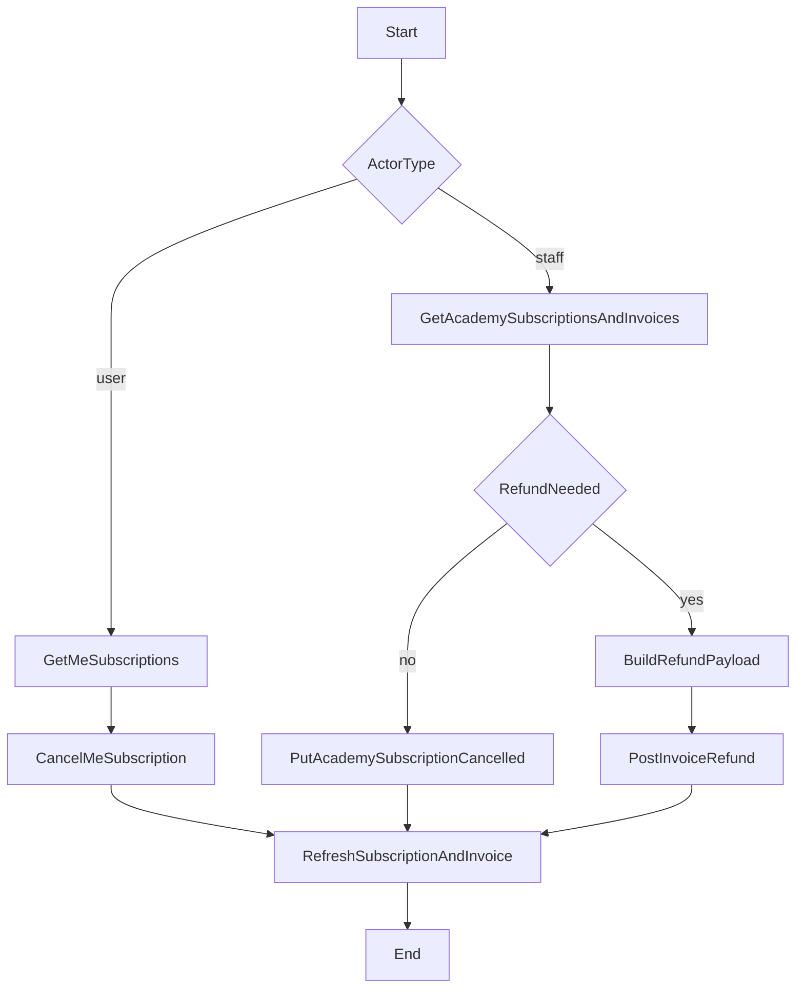

# Skill: Cancel Subscription and Optionally Refund

## When to Use

Use this skill when a product flow needs to cancel a subscription for a standard user or for staff and optionally refund a paid invoice.
Use it when the UI must decide between cancel-only vs cancel-plus-refund behavior.
Do NOT use this skill for void consumption reversals, mentorship session reimbursement, or payment method onboarding.

## Concepts

- Canceling a subscription changes its status and billing behavior, but does not return money by itself.
- Refunding an invoice returns money for a specific paid charge and requires explicit amount allocation by item slug.
- Staff refund decisions are invoice-based, so the flow should resolve invoice data before sending refund requests.
- **Payment rail and where the money goes:** The refund request body does **not** choose a destination card or bank account. What happens depends on how that invoice was paid, as reflected on the invoice:
  - If `stripe_id` is set (Stripe charge id): submitting `POST .../invoice/{invoice_id}/refund` triggers a **Stripe refund** for that charge. Stripe returns funds to the **same payment method that was charged** (for example the same card). How long until the customer sees the credit is governed by **Stripe and the issuer**, not by this API—use cautious copy (for example “refund initiated; may take several business days to appear on the statement”).
  - If `stripe_id` is absent: the API updates invoice and credit-note state **without** calling Stripe. Moving money to the customer then depends on **another process** (manual payout, another provider, or support workflow)—the UI must not promise automatic card repayment in that case.

## Workflow

1. Identify actor and intent.
   - If the actor is a standard user, follow the self-serve cancellation path.
   - If the actor is staff, choose between cancel-only and cancel-plus-refund.

2. For standard users, fetch current subscriptions and show cancelable items.
   - Call `GET /v1/payments/me/subscription`.
   - If the target subscription is not in the default list, allow status-filtered lookup before showing a hard failure.

3. For standard users, cancel subscription.
   - Call `PUT /v1/payments/me/subscription/{subscription_id}/cancel`.
   - Persist returned status and show confirmation.

4. For staff, resolve target user and active payment objects.
   - Call `GET /v1/payments/academy/subscription?users={user_id}`.
   - Call `GET /v1/payments/academy/invoice?user={user_id}`.
   - Use invoice results to decide whether refund is needed.

5. If staff chooses cancel-only, update subscription status.
   - Call `PUT /v1/payments/academy/subscription/{subscription_id}` with `"status": "CANCELLED"`.
   - Stop here when no refund is requested.

6. If staff chooses refund, validate refundability in the UI before submit.
   - Confirm invoice has refundable balance: `amount - amount_refunded > 0`.
   - Build `items_to_refund` from invoice `amount_breakdown` slugs.
   - Ensure `refund_amount` equals the sum of `items_to_refund` values.

7. Submit refund request.
   - If the refund should move money now, call `POST /v1/payments/academy/invoice/{invoice_id}/refund`.
   - If money was already refunded outside this API and you only need reconciliation, call `POST /v1/payments/academy/invoice/{invoice_id}/record-refund`.
   - Save and display returned credit note information for audit history.
   - After success, show payout messaging that matches the invoice: if `stripe_id` was present and `/refund` was used, confirm Stripe refund initiated (`refund_stripe_id` on the credit note when returned); if `/record-refund` was used or `stripe_id` was absent, avoid implying the card was refunded automatically by this API call.

8. Sync post-action state.
   - Refresh subscription and invoice data after cancel and/or refund.
   - Show clear final state: cancelled only, partially refunded, or fully refunded.



## Endpoints

### 1) Get current user subscriptions

- Method: `GET`
- Path: `/v1/payments/me/subscription`
- Required headers:
  - `Authorization: Token <user_token>`
  - Optional `Accept-Language: en|es`
- Query options used in this flow: `status`, `invoice`, `academy`
- Pagination: list endpoint; handle paginated responses by default.
- Relevant response fields: object `id`, `status`, `invoices`.

Sample response (subset):

```json
{
  "count": 1,
  "next": null,
  "previous": null,
  "results": [
    {
      "id": 321,
      "status": "ACTIVE",
      "invoices": [
        {
          "id": 9876,
          "amount": 120.0,
          "amount_refunded": 0.0,
          "currency": {
            "code": "USD"
          }
        }
      ]
    }
  ]
}
```

### 2) Cancel current user subscription

- Method: `PUT`
- Path: `/v1/payments/me/subscription/{subscription_id}/cancel`
- Required headers:
  - `Authorization: Token <user_token>`
  - Optional `Accept-Language: en|es`
- Required body fields: none.
- Relevant response fields: updated subscription object and `status`.

Sample request body:

```json
{}
```

Sample response (subset):

```json
{
  "id": 321,
  "status": "CANCELLED",
  "next_payment_at": "2026-05-01T00:00:00Z"
}
```

### 3) Staff list subscriptions

- Method: `GET`
- Path: `/v1/payments/academy/subscription`
- Required headers:
  - `Authorization: Token <staff_token>`
  - `Academy: 12`
  - Optional `Accept-Language: en|es`
- Capability expectation: `read_subscription`.
- Query options used in this flow: `users`, `status`, `invoice`.
- Pagination: list endpoint; handle paginated responses by default.
- Relevant response fields: `id`, `status`, `user`, `invoices`.

Sample response (subset):

```json
{
  "count": 1,
  "next": null,
  "previous": null,
  "results": [
    {
      "id": 321,
      "status": "ACTIVE",
      "user": 445,
      "invoices": [
        {
          "id": 9876,
          "amount": 120.0,
          "amount_refunded": 0.0
        }
      ]
    }
  ]
}
```

### 4) Staff update subscription status

- Method: `PUT`
- Path: `/v1/payments/academy/subscription/{subscription_id}`
- Required headers:
  - `Authorization: Token <staff_token>`
  - `Academy: 12`
  - Optional `Accept-Language: en|es`
- Required body fields:
  - `status` (for this use case, send `CANCELLED`)
- Relevant response fields: success message.

Sample request body:

```json
{
  "status": "CANCELLED"
}
```

Sample response:

```json
{
  "detail": "Subscription updated successfully"
}
```

### 5) Staff list invoices

- Method: `GET`
- Path: `/v1/payments/academy/invoice`
- Required headers:
  - `Authorization: Token <staff_token>`
  - `Academy: 12`
  - Optional `Accept-Language: en|es`
- Query options used in this flow: `user`, `status`, `date_start`, `date_end`
- Pagination: list endpoint; handle paginated responses by default.
- Relevant response fields: `id`, `amount`, `amount_refunded`, `status`, `amount_breakdown`, `stripe_id`.

Sample response (subset):

```json
{
  "count": 1,
  "next": null,
  "previous": null,
  "results": [
    {
      "id": 9876,
      "status": "FULFILLED",
      "amount": 120.0,
      "amount_refunded": 0.0,
      "stripe_id": "ch_3QX123abc456",
      "amount_breakdown": {
        "plans": {
          "full-stack-plan": {
            "amount": 120.0
          }
        },
        "service-items": {}
      }
    }
  ]
}
```

### 6) Staff refund invoice

- Method: `POST`
- Path: `/v1/payments/academy/invoice/{invoice_id}/refund`
- Required headers:
  - `Authorization: Token <staff_token>`
  - `Academy: 12`
  - Optional `Accept-Language: en|es`
- Capability expectation: `issue_refund`.
- Required body fields:
  - `refund_amount` (number, `> 0`, and must not exceed available refundable amount)
  - `items_to_refund` (object mapping item slug to amount)
- Optional body fields:
  - `reason` (string)
- Relevant response fields: credit note `id`, `invoice`, `amount`, `status`, `refund_stripe_id`.
- **Stripe vs non-Stripe:** If the invoice had `stripe_id`, the backend refunds via Stripe first, then creates the credit note; the response may include `refund_stripe_id`. If the invoice had no `stripe_id`, there is no Stripe refund call—only internal invoice state updates—so do not tell the customer that their card was refunded through Stripe unless `stripe_id` was present on the invoice.

Sample request body:

```json
{
  "refund_amount": 120.0,
  "items_to_refund": {
    "full-stack-plan": 120.0
  },
  "reason": "Customer requested cancellation during trial period."
}
```

Sample response (subset):

```json
{
  "id": 501,
  "invoice": 9876,
  "amount": 120.0,
  "currency": "USD",
  "status": "ISSUED",
  "refund_stripe_id": "re_3QX999abc111"
}
```

### 7) Staff record external refund (no Stripe call)

- Method: `POST`
- Path: `/v1/payments/academy/invoice/{invoice_id}/record-refund`
- Required headers:
  - `Authorization: Token <staff_token>`
  - `Academy: 12`
  - Optional `Accept-Language: en|es`
- Capability expectation: `issue_refund`.
- Required body fields:
  - `refund_amount` (number, `> 0`, and must not exceed available refundable amount)
  - `items_to_refund` (object mapping item slug to amount)
  - `external_reference` (non-empty string; ticket id, wire id, dashboard reference, etc.)
- Optional body fields:
  - `reason` (string)
  - `stripe_refund_id` (string, max 32 chars) when an external Stripe refund id already exists
- Relevant response fields: credit note `id`, `invoice`, `amount`, `status`, `refund_stripe_id`.
- **Important:** this endpoint records the refund in BreatheCode without creating a new Stripe refund. Use it to avoid double refunding when money already moved outside this API.

Sample request body:

```json
{
  "refund_amount": 120.0,
  "items_to_refund": {
    "full-stack-plan": 120.0
  },
  "reason": "Refund was issued manually in finance operations.",
  "external_reference": "ticket-88421",
  "stripe_refund_id": "re_3QX999abc111"
}
```

Sample response (subset):

```json
{
  "id": 502,
  "invoice": 9876,
  "amount": 120.0,
  "currency": "USD",
  "status": "ISSUED",
  "refund_stripe_id": "re_3QX999abc111"
}
```

## Edge Cases

1. Subscription already cancelled or deprecated.
   - Observation: cancel endpoint returns translated `400` error such as `already-cancelled` or `deprecated`.
   - Action: show idempotent UI state and stop retrying cancel.

2. Subscription not found.
   - Observation: endpoint returns `404` with slug similar to `not-found`.
   - Action: refresh list once, then show actionable error and allow selecting another subscription.

3. Subscription missing from default list.
   - Observation: default listing excludes some terminal statuses.
   - Action: allow status-filtered fetch before concluding the subscription is unavailable.

4. Invoice already fully refunded.
   - Observation: refund endpoint returns `400` with `invoice-already-fully-refunded`.
   - Action: disable refund action and present invoice as non-refundable.

5. Refund amount mismatch.
   - Observation: `refund_amount` is different from the sum of `items_to_refund` values.
   - Action: block submit client-side and recompute totals before API call.

6. Invalid slugs in `items_to_refund`.
   - Observation: endpoint returns `400` with `invalid-slugs-in-breakdown`.
   - Action: rebuild payload from `amount_breakdown` keys only.

7. Missing invoice breakdown.
   - Observation: refund breakdown validation fails because `amount_breakdown` is absent.
   - Action: stop automatic refund flow and route to support/ops fallback.

8. Non-refundable invoice state.
   - Observation: invoice is not in a refundable paid state and API rejects the request.
   - Action: present the state and require staff to pick another invoice or stop refund.

9. Partial refund follow-up.
   - Observation: previous partial refund exists (`amount_refunded > 0`).
   - Action: compute remaining refundable amount and cap new request to the remainder.

10. Multi-invoice subscriptions (renewals).
    - Observation: user has multiple charges across periods.
    - Action: require staff to select the exact invoice period before refund submit.

11. Stripe vs non-Stripe charge (`stripe_id`).
    - Observation: invoice may or may not include `stripe_id`. Card and other methods paid **through Stripe** typically have a charge id on the invoice; invoices without it follow the non-Stripe path.
    - Action: use the **same** refund endpoint for both; branch **UX copy only**: when `stripe_id` is present, explain that the refund was sent to the **original payment method** via Stripe and that posting time depends on the bank or card issuer. When `stripe_id` is absent, do **not** promise automatic repayment to the card—surface that finance or support must handle payout outside Stripe.

12. Language and message handling.
    - Observation: errors are translated based on `Accept-Language`.
    - Action: send `Accept-Language` consistently and key client logic by `slug`, not by message text.

13. External refund already issued outside the API.
    - Observation: money has already moved (for example, Stripe Dashboard or bank transfer), but invoice is not reconciled in this system.
    - Action: use `/record-refund` with `external_reference` (and optional `stripe_refund_id`) instead of `/refund` to avoid a second payout attempt.

## Checklist

1. Determine whether the actor is standard user or staff before selecting endpoint path.
2. For cancel-only flows, submit cancellation and refresh the latest subscription state.
3. For refund flows, select the correct invoice and validate refundable balance before submit.
4. Build `items_to_refund` from invoice breakdown slugs and keep totals equal to `refund_amount`.
5. Handle translated error slugs for idempotency, invalid payloads, and non-refundable states.
6. Record and display returned credit note details after successful refund.
7. Use `/record-refund` (not `/refund`) when money was already refunded outside this API.
8. Align success messaging with `stripe_id` and endpoint path: Stripe payout initiated vs reconciliation-only update.
9. Use this detail reference for refund behavior and side effects: [`docs/llm-docs/BC_REFUNDS.md`](../../BC_REFUNDS.md).
