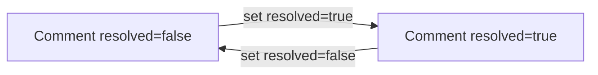
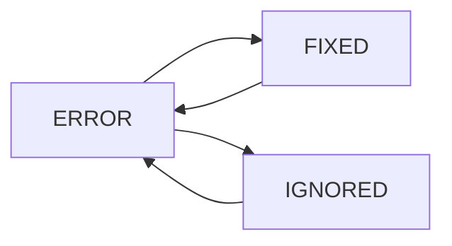

# Skill: Manage Registry Asset Comments and Issues

## When to Use

Use this skill when staff need to create, assign, review, resolve, update, or delete comments on registry assets, and when they need to list/update/delete asset error issues. Use it for academy-scoped moderation and QA workflows. Do NOT use this skill for public learner asset browsing or for editing syllabus/admissions entities outside registry.

## Concepts

- An **asset comment** is a human note attached to an asset (`text`, assignment fields, and resolution flags).
- An **asset issue** here refers to an `AssetErrorLog` record with status lifecycle `ERROR` -> `FIXED` or `IGNORED`.
- An asset issue has a **logical identity** used for deduplication and grouped operations: the same `slug` + `asset_type` + `path` + `asset` (when `asset` is present). When `asset` is missing, the logical identity is `slug` + `asset_type` + `path`.
- Newly logged issues should collapse into that logical identity (re-logging updates the existing row instead of inserting another copy), and the database prevents multiple rows with the same identity going forward.
- A comment is considered "closed" by setting `resolved=true` (there is no separate comment status enum).
- Comments and error logs use different capabilities and different endpoints.
- **Listing comments** requires a single `Academy` header scope and supports optional `academies=<id,id,...>` on GET for read aggregation. The API returns only academies where the user has `read_asset`; if some requested academies are not allowed, response includes `academy_scope` metadata with requested/applied IDs and `resolution=partial`. If none are allowed, the API returns `403`.





## Workflow

1. Set request headers for all calls:
   - `Authorization: Bearer <token>`
   - `Academy: <academy_id>` (required for `/academy/` endpoints)
   - Optional: `Accept-Language: en|es` for translated errors.

2. For comment creation, resolve the target asset first:
   - Use the asset ID or slug known by the caller.
   - `POST /v1/registry/academy/asset/comment` accepts `asset` as either numeric ID or slug.

3. Create a comment:
   - Send `asset` and `text`.
   - `author` is set by the backend from the authenticated user.

4. Review/filter comments:
   - `GET /v1/registry/academy/asset/comment` with filters such as `asset`, `resolved`, `delivered`, `owner`, `author`, and `academies`.
   - The `Academy` header is required (single academy). For read aggregation, send `academies=<id1,id2,...>` in querystring; the API applies only academies where the user has `read_asset`, and partial application returns `academy_scope` metadata.
   - This list is paginated and sorted by newest (`-created_at`) by default.
   - Optional sort overrides are supported, including `sort=priority` and `sort=-priority`.

5. Manage comment lifecycle:
   - Use `PUT /v1/registry/academy/asset/comment/<comment_id>` to update assignment/flags.
   - Use `DELETE /v1/registry/academy/asset/comment/<comment_id>` to remove a comment.
   - To close a comment, set `resolved=true`.

6. Manage asset error issues:
   - List with `GET /v1/registry/academy/asset/error`.
   - Fetch error legend/catalog with `GET /v1/registry/academy/asset/error/catalog`.
   - If the UI still shows multiple identical rows for the same logical issue (legacy data), pick the row you want to keep and call `POST /v1/registry/academy/asset/error/<error_id>/dedupe` on that row id.
   - Update one or many with `PUT /v1/registry/academy/asset/error` (single object or list).
   - Delete one by URL ID or bulk-delete via query lookups.

7. Confirm outcomes after writes:
   - Re-fetch comment/error records after update/delete.
   - For error status updates, expect grouped status propagation across matching rows.

## Endpoints

### Asset Comments

| Action | Method | Path | Required headers | Required body fields | Response notes |
|---|---|---|---|---|---|
| List comments | GET | `/v1/registry/academy/asset/comment` | `Authorization`, `Academy` | None | Paginated list (default sort: newest first). Supports `sort=priority` and `sort=-priority`. Use querystring `academies=<id1,id2,...>` for multi-academy read aggregation. |
| Create comment | POST | `/v1/registry/academy/asset/comment` | `Authorization`, `Academy` | `asset`, `text` | `201` comment object; `author` set from session user. |
| Update comment | PUT | `/v1/registry/academy/asset/comment/<comment_id>` | `Authorization`, `Academy` | None globally required; send fields to change | `200` updated comment object. |
| Delete comment | DELETE | `/v1/registry/academy/asset/comment/<comment_id>` | `Authorization`, `Academy` | None | `204` no content. |

**Permissions**
- GET requires `read_asset`.
- POST/PUT/DELETE require `crud_asset`.

**List scope and filters**
- `academies=<id1,id2,...>` on GET (optional multi-academy) — each ID must be numeric. The API applies only IDs where the user has `read_asset` on an **ACTIVE** academy. If some are filtered, response includes `academy_scope` metadata; if all are filtered, response is `403`.
- `asset=<id1,id2>` or `asset=<slug1,slug2>` (mixed values are supported)
- `resolved=true|false`
- `delivered=true|false`
- `owner=<owner_email>`
- `author=<author_email>`
- `sort=priority|-priority` (optional; default remains `-created_at`)

**Create comment request**
```json
{
  "asset": "javascript-arrays-intro",
  "text": "The instructions need clearer expected output examples."
}
```

**Create comment response**
```json
{
  "id": 823,
  "text": "The instructions need clearer expected output examples.",
  "asset": {
    "id": 301,
    "slug": "javascript-arrays-intro",
    "title": "JavaScript Arrays Intro"
  },
  "resolved": false,
  "delivered": false,
  "priority": 0,
  "author": {
    "id": 17,
    "email": "reviewer@academy.io"
  },
  "owner": null,
  "created_at": "2026-04-02T12:15:10.103Z"
}
```

**Update comment request (close + assign)**
```json
{
  "owner": 42,
  "resolved": true,
  "delivered": true,
  "urgent": false,
  "priority": 2
}
```

**Update comment response**
```json
{
  "id": 823,
  "text": "The instructions need clearer expected output examples.",
  "asset": {
    "id": 301,
    "slug": "javascript-arrays-intro",
    "title": "JavaScript Arrays Intro"
  },
  "resolved": true,
  "delivered": true,
  "priority": 2,
  "author": {
    "id": 17,
    "email": "reviewer@academy.io"
  },
  "owner": {
    "id": 42,
    "email": "owner@academy.io"
  },
  "created_at": "2026-04-02T12:15:10.103Z"
}
```

### Asset Error Issues

| Action | Method | Path | Required headers | Required body fields | Response notes |
|---|---|---|---|---|---|
| List issues | GET | `/v1/registry/academy/asset/error` | `Authorization`, `Academy` | None | Paginated list; supports issue filters and `sort=priority|-priority`. |
| Get issue catalog (legend) | GET | `/v1/registry/academy/asset/error/catalog` | `Authorization`, `Academy` | None | Returns dynamic catalog from `AssetErrorLogType` with descriptions and trigger hints. |
| Dedupe legacy duplicate issues | POST | `/v1/registry/academy/asset/error/<error_id>/dedupe` | `Authorization`, `Academy` | `{}` (empty JSON object) | `200` JSON with `kept`, `deleted_ids`, `deleted_count`. |
| Update issues (single or bulk) | PUT | `/v1/registry/academy/asset/error` | `Authorization`, `Academy` | `id` per object, plus fields to update | `200` list of updated issue objects. |
| Delete one issue | DELETE | `/v1/registry/academy/asset/error/<error_id>` | `Authorization`, `Academy` | None | `204` no content. |
| Delete many issues | DELETE | `/v1/registry/academy/asset/error?<lookups>` | `Authorization`, `Academy` | Query lookups | `204` no content. |

**Permissions**
- GET requires `read_asset_error`.
- PUT/DELETE/POST dedupe require `crud_asset_error`.

**Dedupe behavior (`POST /v1/registry/academy/asset/error/<error_id>/dedupe`)**
- Call this on the issue row id you want to **keep**.
- The API deletes other rows that match the same logical identity as the kept row.
- If there are no duplicates, the API still returns `200` with `deleted_count: 0`.
- If duplicates exist, the API merges a small set of fields onto the kept row before deleting duplicates:
  - `status` uses precedence `ERROR` > `FIXED` > `IGNORED` across the kept row + duplicates.
  - `priority` becomes the maximum value across the kept row + duplicates.
  - If the kept row has an empty `status_text`, it is filled from duplicates (preferring the newest duplicate that has text).
  - If the kept row has no `user`, it may be filled from duplicates (preferring the newest duplicate that has a user).

**Dedupe request**
```json
{}
```

**Dedupe response (no duplicates)**
```json
{
  "kept": {
    "id": 911,
    "slug": "readme-syntax",
    "priority": 0,
    "status": "ERROR",
    "path": "README.md",
    "asset_type": "LESSON",
    "created_at": "2026-04-02T09:18:01.122Z"
  },
  "deleted_ids": [],
  "deleted_count": 0
}
```

**Dedupe response (duplicates removed)**
```json
{
  "kept": {
    "id": 911,
    "slug": "readme-syntax",
    "priority": 3,
    "status": "ERROR",
    "path": "README.md",
    "asset_type": "LESSON",
    "created_at": "2026-04-02T09:18:01.122Z"
  },
  "deleted_ids": [912, 913],
  "deleted_count": 2
}
```

**Catalog (legend) response fields**
- `slug`: canonical error slug.
- `label`: short human-readable name.
- `description`: what the error means.
- `common_trigger_situations`: common scenarios where it is generated.
- `severity_hint`: triage hint (`high`, `medium`, `low`, `unknown`).
- `status_notes`: practical guidance for `ERROR` -> `FIXED`/`IGNORED`.

**Catalog behavior**
- The endpoint is dynamic and auto-discovers values from `AssetErrorLogType`.
- If a new error type is added in code, it appears automatically in the catalog.
- If a slug has no custom metadata yet, fallback defaults are returned so the endpoint remains stable.
- Supports multi-academy read aggregation through `Academy` header (for example, `Academy: 1,2`) with partial-scope metadata when some academies are not allowed.

**List filters (`GET /v1/registry/academy/asset/error`)**
- `asset=<slug1,slug2>`: exact asset slug match (`asset__slug__in`), lowercased server-side.
- `slug=<slug1,slug2>`: exact error slug match (`slug__in`), lowercased server-side.
- `status=ERROR,FIXED,IGNORED`: exact status match (`status__in`), uppercased server-side.
- `asset_type=<type1,type2>`: exact type match (`asset_type__in`), uppercased server-side.
- `like=<search_text>`: fuzzy match over error `slug` or `path` (`icontains`).
- `sort=priority|-priority`: optional ordering override (default remains newest first).

**Filtering examples**
- `GET /v1/registry/academy/asset/error?status=ERROR&asset_type=PROJECT`
- `GET /v1/registry/academy/asset/error?slug=invalid-url,empty-readme`
- `GET /v1/registry/academy/asset/error?asset=javascript-arrays-intro,python-loops`
- `GET /v1/registry/academy/asset/error?like=telemetry`

**Update issue request (single)**
```json
{
  "id": 911,
  "status": "FIXED"
}
```

**Update issue request (bulk list)**
```json
[
  {
    "id": 911,
    "status": "FIXED"
  },
  {
    "id": 912,
    "status": "IGNORED"
  }
]
```

**Update issue response**
```json
[
  {
    "id": 911,
    "slug": "readme-syntax",
    "priority": 0,
    "status": "FIXED",
    "path": "README.md",
    "asset_type": "LESSON",
    "created_at": "2026-04-02T09:18:01.122Z"
  }
]
```

## Edge Cases

1. **Single or multiple academy IDs in header**  
   `Academy` can be a single ID (`Academy: 1`) or a comma-separated list (`Academy: 1,2,3`) for GET aggregation. Mutating endpoints still expect a single academy scope.

2. **Comment text is immutable after creation**  
   `PUT` for comments cannot update `text`, `asset`, or `author`; only lifecycle/assignment fields should be changed.

3. **Owner cannot self-resolve**  
   If the current session user is the same as `owner`, changing `resolved` raises a validation error.

4. **Comment response does not expose all stored fields**  
   `urgent` exists on the model, but the comment response serializer does not return it.

5. **Comment PUT `status` is not a supported lifecycle field**  
   The view checks `status=NOT_STARTED`, but comment serializer logic excludes `author`; do not rely on `status` when updating comments.

6. **Error status updates can affect grouped rows**  
   Updating `status` for one error can propagate to other rows with the same `slug`, `asset_type`, `path`, and `asset`.

7. **Error delete mode validation**  
   Do not mix URL `error_id` with bulk lookup query params in the same delete request.

8. **Dedupe can change fields on the kept row**  
   If duplicates disagree on `status`, `priority`, `status_text`, or `user`, the merge rules on the dedupe endpoint may update the kept row before deleting duplicates. Re-fetch the kept id after dedupe if the UI caches the old values.

9. **Recurring errors return to `ERROR` when re-logged**  
   If an issue was marked `FIXED`/`IGNORED` but the underlying problem happens again, the system may upsert the same logical row back to `ERROR` with refreshed details.

## Checklist

1. Confirmed headers: `Authorization` and `Academy` are set on every `/academy/` call.
2. Used comment `POST` with `asset` + `text`, and verified `author` came from session.
3. Used comment `PUT` only for assignment/lifecycle fields, not `text`.
4. Closed or reopened comments using `resolved` flag and handled owner-resolve restriction.
5. Listed and filtered comments/issues with proper query parameters and used multi-academy `Academy` header on GET when cross-academy aggregation was needed.
6. Updated error issues with awareness of grouped status propagation.
7. If duplicate identical issues were still visible, called `POST /v1/registry/academy/asset/error/<keeper_id>/dedupe` and verified `deleted_count` and the returned `kept.id`.
8. Deleted comments/issues using the correct single or bulk endpoint pattern.
