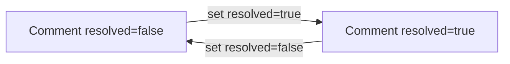
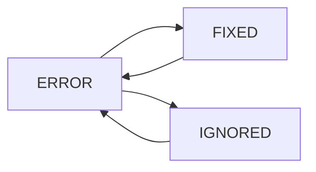

# Skill: Manage Registry Asset Comments and Issues

## When to Use

Use this skill when staff need to create, assign, review, resolve, update, or delete comments on registry assets, and when they need to list/update/delete asset error issues. Use it for academy-scoped moderation and QA workflows. Do NOT use this skill for public learner asset browsing or for editing syllabus/admissions entities outside registry.

## Concepts

- An **asset comment** is a human note attached to an asset (`text`, assignment fields, and resolution flags).
- An **asset issue** here refers to an `AssetErrorLog` record with status lifecycle `ERROR` -> `FIXED` or `IGNORED`.
- A comment is considered "closed" by setting `resolved=true` (there is no separate comment status enum).
- Comments and error logs use different capabilities and different endpoints.
- **Listing comments** is scoped to the academy in the `Academy` header by default. Optional query param `academies=<id>,<id>,...` lets callers request several academies at once; the API returns comments only for assets whose academy is **both** in that list **and** an academy where the user has `read_asset` on an active academy (requested IDs without capability are ignored; invalid tokens in the list return `400`).





## Workflow

1. Set request headers for all calls:
   - `Authorization: Bearer <token>`
   - `Academy: <academy_id>` (required for `/academy/` endpoints)
   - Optional: `Accept-Language: en|es` for translated errors.

2. For comment creation, resolve the target asset first:
   - Use the asset ID or slug known by the caller.
   - `POST /v1/registry/academy/asset/comment` accepts `asset` as either numeric ID or slug.

3. Create a comment:
   - Send `asset` and `text`.
   - `author` is set by the backend from the authenticated user.

4. Review/filter comments:
   - `GET /v1/registry/academy/asset/comment` with filters such as `asset`, `academies`, `resolved`, `delivered`, `owner`, and `author`.
   - The `Academy` header is still required (`capable_of` checks `read_asset` for that academy). To aggregate comments across several academies where the user is allowed, add `academies=<comma-separated numeric ids>`; results include only comments on assets in those academies that pass the permission check.
   - This list is paginated and sorted by newest (`-created_at`) by default.

5. Manage comment lifecycle:
   - Use `PUT /v1/registry/academy/asset/comment/<comment_id>` to update assignment/flags.
   - Use `DELETE /v1/registry/academy/asset/comment/<comment_id>` to remove a comment.
   - To close a comment, set `resolved=true`.

6. Manage asset error issues:
   - List with `GET /v1/registry/academy/asset/error`.
   - Update one or many with `PUT /v1/registry/academy/asset/error` (single object or list).
   - Delete one by URL ID or bulk-delete via query lookups.

7. Confirm outcomes after writes:
   - Re-fetch comment/error records after update/delete.
   - For error status updates, expect grouped status propagation across matching rows.

## Endpoints

### Asset Comments

| Action | Method | Path | Required headers | Required body fields | Response notes |
|---|---|---|---|---|---|
| List comments | GET | `/v1/registry/academy/asset/comment` | `Authorization`, `Academy` | None | Paginated list (default sort: newest first). Optional `academies` query param scopes across multiple allowed academies. |
| Create comment | POST | `/v1/registry/academy/asset/comment` | `Authorization`, `Academy` | `asset`, `text` | `201` comment object; `author` set from session user. |
| Update comment | PUT | `/v1/registry/academy/asset/comment/<comment_id>` | `Authorization`, `Academy` | None globally required; send fields to change | `200` updated comment object. |
| Delete comment | DELETE | `/v1/registry/academy/asset/comment/<comment_id>` | `Authorization`, `Academy` | None | `204` no content. |

**Permissions**
- GET requires `read_asset`.
- POST/PUT/DELETE require `crud_asset`.

**List filters**
- `academies=<id1,id2,...>` (optional) — restrict the list to comments on assets in these academies; each ID must be numeric. Only IDs where the user has `read_asset` on an **ACTIVE** academy are applied; others are skipped (no error). If omitted, only the academy from the `Academy` header is used (unchanged behavior).
- `asset=<id1,id2>` or `asset=<slug1,slug2>` (mixed values are supported)
- `resolved=true|false`
- `delivered=true|false`
- `owner=<owner_email>`
- `author=<author_email>`

**Create comment request**
```json
{
  "asset": "javascript-arrays-intro",
  "text": "The instructions need clearer expected output examples."
}
```

**Create comment response**
```json
{
  "id": 823,
  "text": "The instructions need clearer expected output examples.",
  "asset": {
    "id": 301,
    "slug": "javascript-arrays-intro",
    "title": "JavaScript Arrays Intro"
  },
  "resolved": false,
  "delivered": false,
  "author": {
    "id": 17,
    "email": "reviewer@academy.io"
  },
  "owner": null,
  "created_at": "2026-04-02T12:15:10.103Z"
}
```

**Update comment request (close + assign)**
```json
{
  "owner": 42,
  "resolved": true,
  "delivered": true,
  "urgent": false,
  "priority": 2
}
```

**Update comment response**
```json
{
  "id": 823,
  "text": "The instructions need clearer expected output examples.",
  "asset": {
    "id": 301,
    "slug": "javascript-arrays-intro",
    "title": "JavaScript Arrays Intro"
  },
  "resolved": true,
  "delivered": true,
  "author": {
    "id": 17,
    "email": "reviewer@academy.io"
  },
  "owner": {
    "id": 42,
    "email": "owner@academy.io"
  },
  "created_at": "2026-04-02T12:15:10.103Z"
}
```

### Asset Error Issues

| Action | Method | Path | Required headers | Required body fields | Response notes |
|---|---|---|---|---|---|
| List issues | GET | `/v1/registry/academy/asset/error` | `Authorization`, `Academy` | None | Paginated list; supports issue filters. |
| Update issues (single or bulk) | PUT | `/v1/registry/academy/asset/error` | `Authorization`, `Academy` | `id` per object, plus fields to update | `200` list of updated issue objects. |
| Delete one issue | DELETE | `/v1/registry/academy/asset/error/<error_id>` | `Authorization`, `Academy` | None | `204` no content. |
| Delete many issues | DELETE | `/v1/registry/academy/asset/error?<lookups>` | `Authorization`, `Academy` | Query lookups | `204` no content. |

**Permissions**
- GET requires `read_asset_error`.
- PUT/DELETE require `crud_asset_error`.

**List filters**
- `asset=<slug1,slug2>`
- `slug=<slug1,slug2>`
- `status=ERROR,FIXED,IGNORED`
- `asset_type=<type1,type2>`
- `like=<search_text>`

**Update issue request (single)**
```json
{
  "id": 911,
  "status": "FIXED"
}
```

**Update issue request (bulk list)**
```json
[
  {
    "id": 911,
    "status": "FIXED"
  },
  {
    "id": 912,
    "status": "IGNORED"
  }
]
```

**Update issue response**
```json
[
  {
    "id": 911,
    "slug": "readme-syntax",
    "status": "FIXED",
    "path": "README.md",
    "asset_type": "LESSON",
    "created_at": "2026-04-02T09:18:01.122Z"
  }
]
```

## Edge Cases

1. **`academies` vs header academy**  
   The header academy must still be one where the user has `read_asset` (otherwise the request fails before listing). The `academies` query param only **narrows or expands** which asset academies appear in the comment list; it does not replace the header requirement.

2. **Comment text is immutable after creation**  
   `PUT` for comments cannot update `text`, `asset`, or `author`; only lifecycle/assignment fields should be changed.

3. **Owner cannot self-resolve**  
   If the current session user is the same as `owner`, changing `resolved` raises a validation error.

4. **Comment response does not expose all stored fields**  
   `urgent` and `priority` exist on the model, but the comment response serializer does not return them.

5. **Comment PUT `status` is not a supported lifecycle field**  
   The view checks `status=NOT_STARTED`, but comment serializer logic excludes `author`; do not rely on `status` when updating comments.

6. **Error status updates can affect grouped rows**  
   Updating `status` for one error can propagate to other rows with the same `slug`, `asset_type`, `path`, and `asset`.

7. **Error delete mode validation**  
   Do not mix URL `error_id` with bulk lookup query params in the same delete request.

## Checklist

1. Confirmed headers: `Authorization` and `Academy` are set on every `/academy/` call.
2. Used comment `POST` with `asset` + `text`, and verified `author` came from session.
3. Used comment `PUT` only for assignment/lifecycle fields, not `text`.
4. Closed or reopened comments using `resolved` flag and handled owner-resolve restriction.
5. Listed and filtered comments/issues with proper query parameters (including `academies` when listing across several academies the user may access).
6. Updated error issues with awareness of grouped status propagation.
7. Deleted comments/issues using the correct single or bulk endpoint pattern.
