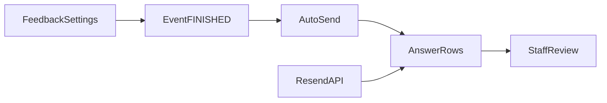

# Skill: Manage Event NPS and Quality Surveys

## When to Use

Use when staff need to enable, verify, resend, or review **legacy event NPS** sent after workshops finish.

Do NOT use for:

- Modern `SurveyStudy` campaigns (`bc-feedback-create-manage-feedback-survey`)
- Cohort monthly surveys (`Survey` + `send_cohort_survey`)
- Creating or running live events (`bc-events-during-event`, `bc-events-create-and-edit-event`)

## Concepts

- **Event survey template:** a shared or academy `SurveyTemplate` assigned as `event_survey_template` in academy feedback settings. Questions come from `when_asking_event`.
- **Automatic send:** when an event's `status` becomes `FINISHED` **and** `ended_at` is set, the platform queues one batch of NPS emails. Staff do not call an endpoint for the first send.
- **Survey audience:** narrower than recording-notification emails. Only check-ins with `attended_at` **and** a linked platform user (`attendee`). Email-only guests are excluded.
- **Answer:** one NPS row per attendee per event. Status values: `PENDING`, `SENT`, `OPENED`, `ANSWERED`, `EXPIRED`.
- **Resend:** staff call `POST .../resend_survey` to email non-responders again or create missing answers for late-recorded attendance. Users with `status == ANSWERED` are always skipped.



## Workflow

1. Set headers for all staff calls.
   - `Authorization: Token <staff_token>`
   - `Academy: <academy_id>`
   - `Content-Type: application/json`
   - Optional `Accept-Language: en|es` for translated errors.

2. List available survey templates.
   - `GET /v1/feedback/academy/survey/template`
   - Pick a template whose `when_asking_event` matches the academy language and question copy.
   - Save `event_survey_template` id (numeric `id` from the list).

3. Configure academy feedback settings (first-time or update).
   - `GET /v1/feedback/academy/feedbacksettings` to read current settings.
   - `PUT /v1/feedback/academy/feedbacksettings` with `event_survey_template` set to the template id from Step 2.
   - To disable event NPS, set `event_survey_template` to `null`.

4. Ensure the workshop is properly closed (load [`bc-events-post-event`](../bc-events-post-event/SKILL.md) if needed).
   - `GET /v1/events/academy/event/<event_id>`
   - Confirm `status == FINISHED` and `ended_at` is not null.
   - Confirm attended check-ins: `GET /v1/events/academy/checkin?event=<event_id>&status=DONE` — attendees need `attended_at` and linked `attendee` for NPS.

5. Verify automatic send created answers.
   - `GET /v1/feedback/academy/answer?event=<event_id>`
   - Expect one row per eligible attendee with `status` `SENT` or later.
   - If empty, check: `ended_at` missing when status changed, no `event_survey_template`, or no eligible check-ins. If `ended_at` was missing on first finish and there are **zero** answers, set `ended_at` then toggle `status` from `ACTIVE` to `FINISHED` once (only works when no answers exist yet).

6. Resend to non-responders (optional).
   - `POST /v1/feedback/academy/event/<event_id>/resend_survey`
   - Omit `user_ids` to target all eligible attendees, or pass specific ids.
   - Use `dry_run: true` first to preview who would be emailed.
   - Already-answered users appear in `skipped_answered` and are never emailed again.

7. Review results.
   - `GET /v1/feedback/academy/answer?event=<event_id>&status=ANSWERED` for completed responses.
   - `GET /v1/feedback/academy/answer/<answer_id>` for one response with score and comment.
   - Compute response rate client-side: `ANSWERED` count / total eligible attendees. There is no dedicated event NPS aggregate endpoint.

## Endpoints

### List survey templates

- Method: `GET`
- Path: `/v1/feedback/academy/survey/template`
- Capability: `read_survey_template`
- Pagination: not paginated (returns a flat array).

Response:

```json
[
  {
    "id": 12,
    "slug": "default-nps-en",
    "lang": "en",
    "is_shared": true,
    "when_asking_event": {
      "title": "How likely are you to recommend events like this to your friends and family?",
      "highest": "very likely",
      "lowest": "not likely",
      "survey_subject": "One question about the event you attended today"
    },
    "when_asking_mentor": {},
    "when_asking_cohort": {},
    "when_asking_academy": {},
    "when_asking_mentorshipsession": {},
    "when_asking_platform": {},
    "when_asking_liveclass_mentor": {},
    "when_asking_mentor_communication": {},
    "when_asking_mentor_participation": {},
    "additional_questions": {},
    "original": null
  }
]
```

### Get academy feedback settings

- Method: `GET`
- Path: `/v1/feedback/academy/feedbacksettings`
- Capability: `get_academy_feedback_settings`

Response:

```json
{
  "id": 3,
  "cohort_survey_template": { "id": 12, "slug": "default-nps-en", "lang": "en" },
  "liveclass_survey_template": { "id": 12, "slug": "default-nps-en", "lang": "en" },
  "event_survey_template": { "id": 12, "slug": "default-nps-en", "lang": "en" },
  "mentorship_session_survey_template": { "id": 12, "slug": "default-nps-en", "lang": "en" },
  "liveclass_survey_cohort_exclusions": null,
  "created_at": "2026-01-10T08:00:00Z",
  "updated_at": "2026-03-15T14:30:00Z"
}
```

### Update academy feedback settings

- Method: `PUT`
- Path: `/v1/feedback/academy/feedbacksettings`
- Capability: `crud_academy_feedback_settings`

Request:

```json
{
  "event_survey_template": 12
}
```

Response: same shape as GET (updated `event_survey_template` reflected).

### List event answers

- Method: `GET`
- Path: `/v1/feedback/academy/answer?event=<event_id>&status=SENT,OPENED,ANSWERED&limit=20&offset=0`
- Capability: `read_nps_answers`
- Pagination: yes — use `limit` and `offset`.

Response:

```json
{
  "count": 2,
  "next": null,
  "previous": null,
  "results": [
    {
      "id": 9001,
      "title": "How likely are you to recommend events like this to your friends and family?",
      "lowest": "not likely",
      "highest": "very likely",
      "lang": "en",
      "comment": null,
      "score": null,
      "status": "SENT",
      "created_at": "2026-06-20T22:05:00Z",
      "user": { "id": 501, "first_name": "Ana", "last_name": "Lopez" },
      "event": { "id": 88, "slug": "intro-python-june", "title": "Intro to Python" }
    },
    {
      "id": 9002,
      "title": "How likely are you to recommend events like this to your friends and family?",
      "lowest": "not likely",
      "highest": "very likely",
      "lang": "en",
      "comment": "Great workshop!",
      "score": 9,
      "status": "ANSWERED",
      "created_at": "2026-06-20T22:05:00Z",
      "user": { "id": 502, "first_name": "Luis", "last_name": "Perez" },
      "event": { "id": 88, "slug": "intro-python-june", "title": "Intro to Python" }
    }
  ]
}
```

### Get one answer

- Method: `GET`
- Path: `/v1/feedback/academy/answer/<answer_id>`
- Capability: `read_nps_answers`

Response:

```json
{
  "id": 9002,
  "title": "How likely are you to recommend events like this to your friends and family?",
  "lowest": "not likely",
  "highest": "very likely",
  "lang": "en",
  "comment": "Great workshop!",
  "score": 9,
  "status": "ANSWERED",
  "created_at": "2026-06-20T22:05:00Z",
  "updated_at": "2026-06-20T23:10:00Z",
  "opened_at": "2026-06-20T23:05:00Z",
  "user": { "id": 502, "first_name": "Luis", "last_name": "Perez" },
  "event": { "id": 88, "slug": "intro-python-june", "title": "Intro to Python" }
}
```

### Resend event survey

- Method: `POST`
- Path: `/v1/feedback/academy/event/<event_id>/resend_survey`
- Capability: `crud_survey`

Request (all attendees):

```json
{
  "dry_run": false
}
```

Request (specific users):

```json
{
  "user_ids": [501, 503],
  "dry_run": false
}
```

Response:

```json
{
  "event_id": 88,
  "academy_id": 12,
  "dry_run": false,
  "resent": [
    { "user_id": 501, "answer_id": 9001, "scheduled": true }
  ],
  "created": [
    { "user_id": 503, "answer_id": 9004, "scheduled": true }
  ],
  "skipped_answered": [
    { "user_id": 502, "answer_id": 9002 }
  ],
  "skipped_no_email": [],
  "skipped_ineligible": [
    { "user_id": 505, "reason": "not_attended_or_no_platform_user" }
  ]
}
```

## Edge Cases

- **`event-survey-template-not-configured`** — `PUT` feedback settings with a valid `event_survey_template` before expecting automatic or manual sends.
- **`event-not-finished`** — resend requires `status == FINISHED` and `ended_at` set. Finish the event first via [`bc-events-post-event`](../bc-events-post-event/SKILL.md).
- **Automatic send skipped** — if `ended_at` was null when status first became `FINISHED`, no emails were sent. Fix `ended_at`, then toggle `ACTIVE` → `FINISHED` only when zero answers exist for the event.
- **No answers after finish** — check attendance: guests with email only (no `attendee` user) are not surveyed. Import or reconcile check-ins first.
- **`skipped_answered` on resend** — expected; never resend to users who already submitted a score.
- **`skipped_no_email`** — user has no email on file; resolve identity/contact before resending.
- **`dry_run: true`** — previews `created` vs `resent` without writing answers or sending email.
- **Confusion with SurveyStudy** — event NPS uses `Answer` rows and `nps.4geeks.com/{answer_id}` links, not `SurveyResponse` / study `send_emails`.

## Checklist

1. Headers set (`Authorization`, `Academy`, `Content-Type`).
2. Survey template listed and `event_survey_template` assigned via feedback settings.
3. Event confirmed `FINISHED` with `ended_at` and eligible attended check-ins.
4. Answers listed for the event (`GET .../answer?event=...`).
5. Resend executed if needed (`POST .../resend_survey`), with `skipped_answered` reviewed.
6. Results reviewed (`status=ANSWERED`, scores and comments inspected).
