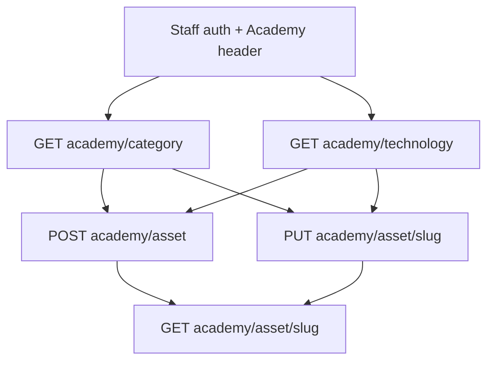

# Skill: Manage Registry Assets

## When to Use

Use when staff need to **create, list, get, or update** academy learning assets, including resolving and assigning **category** and **technologies** (optional SEO keywords). Do NOT use to create, parent, deprecate, or merge the technology catalog ([`bc-registry-manage-technologies`](../bc-registry-manage-technologies/SKILL.md)), for asset comments or error issues ([`bc-registry-asset-comments-and-issues`](../bc-registry-asset-comments-and-issues/SKILL.md)), LearnPack telemetry (`bc-assignment-diagnose-asset-telemetry`), PROJECT task review ([`bc-assignment-review-submit-task-revision`](../bc-assignment-review-submit-task-revision/SKILL.md)), or public learner catalog browsing.

Full field meanings: [reference/asset-fields.md](reference/asset-fields.md).

## Concepts

- Paths are `/v1/registry/academy/asset` with header **`Academy`**. Do not put the academy id in the path.
- **`slug` is globally unique** across academies. An existing asset alias with that slug → 400.
- **`lang` is required** on create. Stored lowercase. `"en"` is stored as `"us"`.
- **Create requires `category`** (numeric id) unless `all_translations` can supply a matching-language category (`no-category`). `"uncategorized"` is allowed **only on POST**. PUT cannot null category; category language must match the asset (`us`/`en` equivalent).
- **Technologies are a full-list replace** of existing slugs. `[]` clears. Omit the field to leave unchanged. Unknown slug → 400. There is **no POST to create a technology**. GET asset returns **parent slugs only**. To create, parent, deprecate, or merge catalog slugs, use [`bc-registry-manage-technologies`](../bc-registry-manage-technologies/SKILL.md).
- Default create **`status` is `NOT_STARTED`**. There is **no `DELETED`**. The public website shows **`PUBLISHED`** only.
- Publishing (`status=PUBLISHED` or `visibility` `PUBLIC`/`UNLISTED`) requires `test_status` `OK` or `WARNING`.
- List GET defaults **`visibility=PUBLIC`** and **`external=false`**. Drafts that are private/unlisted will not appear unless you pass those filters.
- Role `content_writer` may only change `status`, and not to `PUBLISHED`.
- **`graded` is deprecated.** All assets are graded with AI. Do not set it to enable grading or telemetry. LearnPack `config.grading` (`isolated`/`incremental`) is step mode, not this flag.
- For PROJECT/EXERCISE, a GitHub pull can overwrite `interactive`, `gitpod`, `with_video`, `with_solutions`, `title`, `description`, `technologies`, delivery fields, and `agent`.
- GitHub actions (`pull`, `push`, `test`, `clean`, `create_repo`), SEO, thumbnail, and originality exist under `/academy/asset/{slug}/action/{action}` and related routes. Do not use this skill to run them.



## Workflow

1. Authenticate staff per [`bc-authenticate-staff-authentication`](../bc-authenticate-staff-authentication/SKILL.md). Confirm `crud_asset` (writes) or `read_asset` (reads). Send **`Academy: <academy_id>`**. Optional **`Accept-Language: en|es`**.
2. Resolve **category**: `GET /v1/registry/academy/category` (`read_category`, paginated). Filter with `like=` and `lang=us` (`us`/`en` match). If none fits, `POST /v1/registry/academy/category` (`crud_category`) and save the returned **`id`**.
3. Resolve **technologies**: `GET /v1/registry/academy/technology` (`read_technology`, paginated). Default list is `visibility=PUBLIC` and **parents only**. Use `like=python`, `include_children=true`, and/or `visibility=PUBLIC,UNLISTED` when the slug is a child or unlisted. Collect **existing** slugs; do not invent them. Prefer parent slugs. If the slug is missing or duplicates need merging, switch to [`bc-registry-manage-technologies`](../bc-registry-manage-technologies/SKILL.md) — this skill only assigns slugs onto assets.
4. Optional **keywords**: `GET /v1/registry/academy/keyword` (`read_keyword`). Prefer at most two slugs on the asset.
5. **Create:** `POST /v1/registry/academy/asset` with `slug`, `title`, `asset_type`, `lang`, `category` (id), optional `technologies` (slugs). Omit `graded`. Never send `readme` — use `readme_raw`. If `readme_url` is a GitHub URL and `readme_raw` is empty, create queues an async pull.
6. **Update / add or remove technologies:** `GET /v1/registry/academy/asset/{slug_or_id}` first. Then `PUT` the **full** desired `technologies` list and/or `category` id. Bulk PUT to `/v1/registry/academy/asset` requires each object’s `id`.
7. Re-GET to confirm. `technologies` is a slug array (parents). `category` is `{id, slug, title}`. If the user asked for comments, GitHub sync, or telemetry, switch skills.

## Endpoints

All `/academy/` routes require **`Authorization`** and **`Academy`**. Lists are paginated (`limit`, `offset`). Send **`Accept-Language: en|es`** for translated errors.

### List categories

- **Method / path:** `GET /v1/registry/academy/category`
- **Capability:** `read_category`
- **Query:** `like`, `lang` (`us` matches `en`). **Pagination:** yes.

**Response `200` (one element):**

```json
{
  "id": 12,
  "slug": "web-development",
  "title": "Web Development",
  "lang": "us",
  "academy": { "id": 4, "name": "Downtown Miami" }
}
```

### Create category

- **Method / path:** `POST /v1/registry/academy/category`
- **Capability:** `crud_category`
- **Required body:** `slug`, `title`, `lang`

**Request:**

```json
{
  "slug": "web-development",
  "title": "Web Development",
  "lang": "us",
  "description": "Front-end and back-end web content",
  "visibility": "PUBLIC"
}
```

Use the returned **`id`** as asset `category`. Do not send that slug as `category` on the asset.

### List technologies

- **Method / path:** `GET /v1/registry/academy/technology`
- **Capability:** `read_technology`
- **Query:** `like`, `include_children=true`, `visibility` (default `PUBLIC`), `lang`/`language`, `is_deprecated` (default excludes deprecated). **Pagination:** yes.

**Response `200` (one element, abbreviated):**

```json
{
  "slug": "python",
  "title": "Python",
  "description": "Python programming language",
  "icon_url": "https://cdn.4geeks.com/icons/python.png",
  "is_deprecated": false,
  "visibility": "PUBLIC",
  "parent": null,
  "sort_priority": 1,
  "lang": null
}
```

### List keywords (optional)

- **Method / path:** `GET /v1/registry/academy/keyword`
- **Capability:** `read_keyword`
- **Query:** `like`, `lang`, `cluster`. **Pagination:** yes.

**Response `200` (one element):**

```json
{
  "id": 88,
  "slug": "learn-python",
  "title": "Learn Python"
}
```

### List assets

- **Method / path:** `GET /v1/registry/academy/asset`
- **Capability:** `read_asset`
- **Query:** `like` (title/slug/url), `asset_type` (exact), `status` (comma-separated; default excludes a leftover `DELETED` value), `visibility` (default `PUBLIC`), `lang`/`language`, `technologies` (slugs), `category` (**slugs**, not ids), `external` (`true`/`false`/`both`; default internal only), `superseded_by` (`null` for latest), `test_status`, `sync_status`, `interactive=true`, `graded=true` (legacy filter; do not use as a grading workflow), `video=true`. **Pagination:** yes.

**Response `200`:** paginated `AcademyAssetSerializer` rows (same shape as Get asset below).

### Get asset

- **Method / path:** `GET /v1/registry/academy/asset/{slug_or_id}`
- **Capability:** `read_asset`

**Response `200` (abbreviated):**

```json
{
  "id": 301,
  "slug": "intro-to-python",
  "title": "Introduction to Python",
  "asset_type": "LESSON",
  "lang": "us",
  "status": "DRAFT",
  "visibility": "PUBLIC",
  "category": { "id": 12, "slug": "web-development", "title": "Web Development" },
  "technologies": ["python"],
  "academy": 4,
  "test_status": null,
  "sync_status": null,
  "readme_url": "https://github.com/4GeeksAcademy/content/blob/master/src/content/lesson/intro-to-python.md",
  "graded": false
}
```

### Create asset

- **Method / path:** `POST /v1/registry/academy/asset`
- **Capability:** `crud_asset`
- **Required body:** `slug`, `asset_type`, `lang`, `category` (numeric id). Always send `title`.

**Request:**

```json
{
  "slug": "intro-to-python",
  "title": "Introduction to Python",
  "asset_type": "LESSON",
  "lang": "us",
  "category": 12,
  "technologies": ["python"],
  "description": "Learn Python basics with short examples",
  "readme_url": "https://github.com/4GeeksAcademy/content/blob/master/src/content/lesson/intro-to-python.md",
  "status": "DRAFT",
  "visibility": "PRIVATE"
}
```

**Response `201`:** created asset (`AssetBigSerializer`). `technologies` is a slug array. `category` is `{id, slug, title}`. `academy` is `{id, name}`. Default `status` is `NOT_STARTED` if omitted. Omit `graded`.

### Update asset

- **Method / path:** `PUT /v1/registry/academy/asset/{slug_or_id}`
- **Capability:** `crud_asset`
- **Body:** only fields to change. URL slug/id wins over a stale body `id`.

**Add/remove technologies (full replace):**

```json
{
  "technologies": ["python", "flask"]
}
```

Keep only Python: `{ "technologies": ["python"] }`. Clear all: `{ "technologies": [] }`.

**Assign category:**

```json
{
  "category": 12
}
```

**Response `200`:** updated academy asset (same GET shape). `academy` is a numeric id.

Bulk update: `PUT /v1/registry/academy/asset` with a JSON array. Each object must include `id`.

## Edge Cases

- **Technology not found:** 400 `The following technologies were not found: …`. List technologies again; do not invent slugs. Catalog create/parent/merge is [`bc-registry-manage-technologies`](../bc-registry-manage-technologies/SKILL.md).
- **`no-category` / empty category:** create without category (and without a usable translation) fails. PUT with null category fails (`Asset category cannot be null`).
- **`no-language`:** create without `lang` fails.
- **Slug or alias taken:** 400. Choose another global slug.
- **Publish blocked:** `status=PUBLISHED` or `visibility` PUBLIC/UNLISTED with `test_status` not `OK`/`WARNING` → 400 tests must pass first. Leave as `DRAFT` until tests pass.
- **List looks empty:** default `visibility=PUBLIC` and `external=false`. Pass `status=` and `visibility=PUBLIC,UNLISTED,PRIVATE` to find drafts.
- **Child technology missing on GET:** GET returns parent slugs only. Prefer parent slugs when assigning.
- **`content_writer`:** only `status` changes (`NOT_STARTED`, `PLANNING`, `WRITING`, `DRAFT`, `OPTIMIZED`), not `PUBLISHED`, and only on assets they author.
- **Unclaimed asset:** PUT from this academy claims it (`academy` was null).
- **`readme` vs `readme_raw`:** sending `readme` → 400. Write `readme_raw`.
- **`graded`:** ignore for grading and telemetry. Do not set it on create.

## Checklist

1. [ ] Authenticated with `crud_asset`/`read_asset` and sent `Academy`.
2. [ ] Listed categories and used a numeric **id** (created a category only if none fit).
3. [ ] Listed technologies and used existing **slugs** (full list on PUT).
4. [ ] Create sent `slug`, `title`, `asset_type`, `lang`, `category`; omitted `graded` and `readme`.
5. [ ] Re-GET confirmed `category` and `technologies`.
6. [ ] Switched skills for catalog merge/parent, comments, GitHub actions, or telemetry if those were requested.
