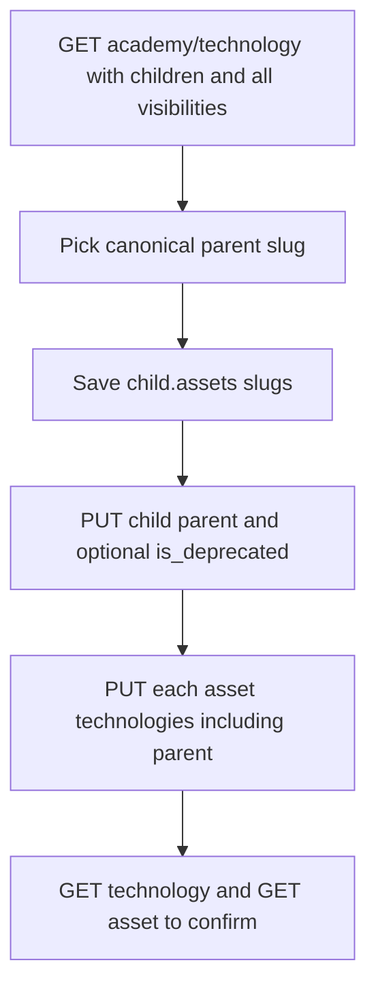

# Skill: Manage Registry Technologies

## When to Use

Use when staff need to **inspect, update, or normalize** the global technology catalog: find duplicate slugs, assign a parent (alias), change visibility or priority, or deprecate an alias. Do NOT use to assign technologies onto an asset (use [`bc-registry-manage-assets`](../bc-registry-manage-assets/SKILL.md)), for SEO keywords, or for `technologies` strings on talent-development skills, marketing courses, or events.

## Concepts

- Catalog is **global** (not academy-owned). `/academy/` routes still require header **`Academy`**.
- **Parent vs alias:** one level only. A parent cannot itself have a parent. List default is **parents only**. Children are aliases (`alias` on the parent is their slug array).
- **Visibility:** `PUBLIC` = frontend landing page. `UNLISTED` = shown on assets, no landing (typical for newly ingested slugs). `PRIVATE` = hidden on the frontend. Academy list defaults to **`PUBLIC`** — aliases are often `UNLISTED`.
- **`sort_priority`:** `1` (primary, sorts first), `2`, or `3`.
- **`is_deprecated`:** only valid when the row already has a parent. Lists hide deprecated unless `is_deprecated=true`.
- **The API does not create, delete, or rename a technology slug.** New slugs appear when GitHub pull / `learn.json` / frontmatter ingest an unknown name.
- **PUT `parent` does not retag assets.** Save the child’s `assets` (asset slugs tagged with **that** row) **before** parenting. Then retag those assets with the parent slug via [`bc-registry-manage-assets`](../bc-registry-manage-assets/SKILL.md) (full-list `technologies` PUT). Asset GET returns **parent slugs only**.
- After a parent is set, a later GitHub pull **does** resolve the alias and stores the parent. Staff asset PUT does **not** walk to the parent — assigning a child slug stores the child and it can vanish from asset GET.
- Not SEO keywords. Not talent-development / marketing / events `technologies` strings.



## Workflow

1. Authenticate staff per [`bc-authenticate-staff-authentication`](../bc-authenticate-staff-authentication/SKILL.md). If that skill is not loaded, load it first. Confirm `read_technology` (reads) or `crud_technology` (writes). Send **`Academy: <academy_id>`**. Optional **`Accept-Language: en|es`**.
2. **Inspect:** `GET /v1/registry/academy/technology` with `include_children=true` and `visibility=PUBLIC,UNLISTED,PRIVATE`. Add `like=react` to search. Paginate with `limit` and `offset`. To fetch one row, add `slug=reactjs` plus those same flags (default list hides children, unlisted, and deprecated). Record `slug`, `parent`, `alias`, `assets`, `visibility`, `sort_priority`, `is_deprecated`.
3. **Update metadata** (optional): `PUT /v1/registry/academy/technology/{slug}` with only fields to change (`title`, `description`, `icon_url`, `visibility`, `sort_priority`, `lang`, `featured_asset` as a numeric asset id). Never send `slug`.
4. **Normalize duplicates:** pick the canonical **parent** (the slug that should appear on assets and landings). For each alias: save `assets` first (parenting does not copy tags; a parent’s `assets` is not the union of aliases). Then PUT `{ "parent": "<parent-slug>" }`. Optionally also `{ "is_deprecated": true, "visibility": "UNLISTED" }` on the child. If PUT says the target is itself a child, stop and choose a real parent (`parent` must be null).
5. **Retag:** load [`bc-registry-manage-assets`](../bc-registry-manage-assets/SKILL.md). For each slug in the saved `assets` array, GET the asset, then PUT the **full** `technologies` list including the parent and the other current parent slugs from GET. Do not leave the asset tagged only with the child.
6. Re-GET the parent with `include_children=true` and `slug=<parent>` (plus visibility flags). `alias` must list the children. GET a sample asset; `technologies` must include the parent slug.

## Endpoints

All `/academy/` routes require **`Authorization`** and **`Academy`**. Lists are paginated (`limit`, `offset`). Send **`Accept-Language: en|es`** for translated errors.

### List technologies

- **Method / path:** `GET /v1/registry/academy/technology`
- **Capability:** `read_technology`
- **Query:** `like`, `include_children=true`, `visibility` (comma-separated; default `PUBLIC`), `slug` (comma-separated), `parent` (comma-separated parent **ids** — lists children of those parents), `lang`/`language`, `sort_priority` (single integer), `is_deprecated` (default excludes deprecated), `asset_slug`, `asset_type`. **Pagination:** yes.

**Response `200` (parent row):**

```json
{
  "slug": "react",
  "title": "React",
  "description": "React UI library",
  "icon_url": "https://cdn.4geeks.com/icons/react.png",
  "is_deprecated": false,
  "visibility": "PUBLIC",
  "parent": null,
  "sort_priority": 1,
  "lang": null,
  "alias": ["reactjs", "react-js"],
  "assets": ["learn-react-tutorial"],
  "featured_course": null,
  "marketing_information": null
}
```

**Response `200` (alias / child row):**

```json
{
  "slug": "reactjs",
  "title": "ReactJS",
  "description": null,
  "icon_url": null,
  "is_deprecated": false,
  "visibility": "UNLISTED",
  "parent": {
    "slug": "react",
    "title": "React",
    "description": "React UI library",
    "icon_url": "https://cdn.4geeks.com/icons/react.png",
    "is_deprecated": false,
    "visibility": "PUBLIC"
  },
  "sort_priority": 3,
  "lang": null,
  "alias": [],
  "assets": ["old-react-exercise"],
  "featured_course": null,
  "marketing_information": null
}
```

`assets` is asset slugs tagged with **this row’s id**, not the parent’s. `alias` is child slugs of **this** row. List GET does not return `featured_asset`.

### Update technology / assign parent

- **Method / path:** `PUT /v1/registry/academy/technology/{slug}`
- **Capability:** `crud_technology`
- **Body:** only fields to change. Never send `slug` (immutable). `parent` is a parent **slug** or numeric **id**, or `null` to unparent.

**Assign parent:**

```json
{
  "parent": "react"
}
```

**Deprecate an alias (only after it has a parent):**

```json
{
  "parent": "react",
  "is_deprecated": true,
  "visibility": "UNLISTED"
}
```

**Update catalog metadata:**

```json
{
  "title": "React",
  "description": "React UI library",
  "icon_url": "https://cdn.4geeks.com/icons/react.png",
  "visibility": "PUBLIC",
  "sort_priority": 1,
  "lang": null
}
```

**Response `200`:** same shape as list (one object). After parenting, `parent` is the parent object and the parent’s later GET `alias` includes this slug.

Bulk same payload: `PUT /v1/registry/academy/technology?slug=reactjs,react-js` with the JSON body above. Do **not** also put a slug in the path. Response is an **array** of the same objects.

## Edge Cases

- **List looks empty:** default `visibility=PUBLIC` and **parents only**, and deprecated rows are hidden. Pass `include_children=true`, `visibility=PUBLIC,UNLISTED,PRIVATE`, and `is_deprecated=true` when hunting aliases. Do not invent slugs.
- **Technology does not exist for this academy:** PUT 404. List again with widened filters; the API does not create technologies.
- **Parent is itself a child:** 400 `The technology parent you are trying to set …, its a child of another technology, only technologies without parent can be set as parent`. Choose a row whose `parent` is `null`.
- **Parent slug or id not found:** 400. List parents (`include_children` omitted or false) and use an existing parent slug.
- **Missing technology slug(s):** PUT without path slug and without `?slug=` → 400. Send the slug in the path or querystring, not both.
- **PUT parent does not copy tags:** if you skip retag, asset GET can omit the technology (GET returns parent slugs only; the child is hidden). Always save `assets` before parenting, then PUT those assets with the parent slug.
- **`assets` on a parent** are only rows tagged with the parent id, not the union of aliases. Use each child’s `assets` before parenting.
- **Cannot deprecate a parent-less row.** Set `parent` first (same PUT or earlier), then `is_deprecated=true`.
- **Cannot nest parents.** One hop only. Unparent with `"parent": null` before promoting a former child to canonical parent.
- **Cannot create, delete, or rename slug.** If the user needs a new canonical slug that does not exist, stop and explain the API does not expose create; a new slug only appears after ingest of that name.
- **Unknown slug on asset assignment:** that 400 is from manage-assets. Do not invent slugs here either.
- **Bulk PUT** applies **one body** to every slug in `?slug=`. Do not mix different parents in one bulk call.
- **Path + querystring together:** PUT with both `{slug}` in the path and `?slug=` → 400. Use one style.

## Checklist

1. [ ] Authenticated with `read_technology`/`crud_technology` and sent `Academy`.
2. [ ] Listed with `include_children=true` and `visibility=PUBLIC,UNLISTED,PRIVATE` before concluding a slug is missing.
3. [ ] Saved each alias `assets` array **before** PUT `parent`.
4. [ ] PUT parent used a canonical slug whose own `parent` is null; never sent `slug` in the body.
5. [ ] Retagged those assets via [`bc-registry-manage-assets`](../bc-registry-manage-assets/SKILL.md) so GET asset `technologies` includes the parent.
6. [ ] Re-GET parent shows children in `alias`; sample asset shows the parent slug.
